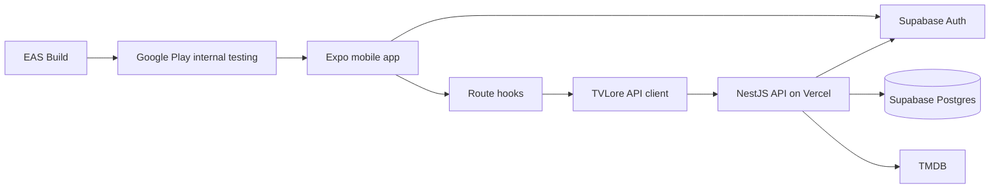

# Architecture

TVLore uses a mobile-first monorepo with a React Native mobile app, a NestJS API, shared transport contracts, and documentation.

## Current Architecture Snapshot

The current implementation is a modular monolith backend plus a mobile-first
Expo client:

```text
Mobile screen
-> route hook
-> TVLore API/auth client
-> NestJS controller
-> service/use case
-> repository or provider
-> Supabase Auth, Supabase Postgres, or TMDB
```

Runtime diagram:



The backend owns product meaning. The mobile app owns presentation and local
interaction only.

Current primary product surfaces:

| Surface | Owns | Does not own |
| --- | --- | --- |
| Library | Rendering personal summaries, filters, grouped rows, swipe confirmations, chronology paging UI. | Canonical watched state, progress, or library counts. |
| Search | Query input, filters, discovery entry cards, result navigation. | TMDB credentials, catalog identity, recommendation ranking. |
| Paths | Path list/detail presentation and import form input. | Path persistence, TMDB collection hydration, bulk save semantics. |
| Profile | User identity display, country selector UI, legal links, logout/delete entry points. | Auth provider identity, account deletion policy, database cleanup. |
| Detail screens | Posters, ratings, tracking controls, skeletons, local optimistic feedback. | Authorization, progress calculation, watch-provider orchestration. |
| Check-in | Rating/emotion/character/comment form. | Reflection persistence, preference synchronization, privacy rules. |

Conceptual structure:

```text
/
|-- apps/
|   |-- mobile/
|   `-- api/
|
|-- packages/
|   `-- contracts/
|
`-- docs/
```

Future applications may be added later:

```text
apps/
|-- mobile/
|-- api/
|-- web/      # future
`-- admin/    # future
```

Do not create future apps until there is a concrete need.

## Fundamental Rule

The backend is the source of truth.

This rule is the guardrail that keeps TVLore from becoming hard to reason
about as the feature set grows. Mobile can keep local pending state or a
short-lived read cache to feel fast. The API decides whether something is
allowed, persisted, visible, complete, deleted, or counted.

The mobile client may contain:

- UI logic.
- Presentation logic.
- Navigation logic.
- Structural input validation.
- Form validation.
- Local interactions.
- Loading/error presentation.
- Device-specific behavior.
- Temporary UI state.

The backend must contain:

- Business rules.
- Authorization.
- Resource ownership.
- Tracking rules.
- Progress calculation.
- Rewatch semantics.
- State transitions.
- Data consistency.
- Provider orchestration.
- Persistence rules.
- Privacy rules.
- Future matching logic.
- Future compatibility calculations.

Deleting the React Native application must not delete any business behavior.

## Implemented Backend Ownership

| Backend area | Owns |
| --- | --- |
| `auth` | Bearer-token extraction, Supabase token validation, Supabase Admin deletion calls. |
| `users` | Internal TVLore user identity, profile settings, availability country, account-deletion readiness. |
| `catalog` | TMDB search/resolve/detail, TVLore catalog identity, cast, public rating, watch providers. |
| `tracking` | Movie/episode/season/full-show watched state and progress updates. |
| `watchlist` | Saved intent for shows and movies. |
| `preferences` | Explicit 1-5 ratings for shows, movies, and episodes. |
| `reflections` | Private post-watch reaction, favorite character, and optional comment. |
| `library` | Library summary, grouped history, continue watching, rated titles, paginated Cronologia. |
| `recommendations` | Explainable TVLore score from ratings, genres, media affinity, and availability. |
| `discovery` | TVLore Picks, available-to-stream, and popular-in-country rows. |
| `watch-paths` | Curated paths, user paths, TMDB imports, ordered path items, save-to-watchlist. |
| `legal` | Public Privacy, Terms, Support, and account deletion pages. |

## Implemented Mobile Ownership

| Mobile area | Owns |
| --- | --- |
| `src/api` | Typed API facade, response guards, short-lived read cache, mutation cache invalidation. |
| `src/auth` | Supabase mobile session, OAuth callback handling, local sign-in/sign-out. |
| `src/library` and `src/home` | Library/Profile data hooks, presentation composition, chronology pagination, optimistic swipe UI. |
| `src/search` | Search input, filters, discovery routes, result skeletons, lookahead prefetch. |
| `src/catalog` | Show/movie/season/episode detail screens, tracking controls, rating UI, provider panels. |
| `src/watch-paths` | Path list/detail routes and import UI. |
| `src/ui` | Reusable visual primitives: text, buttons, badges, panels, posters, skeletons, stat cards, rows, tokens. |

## Release Architecture

The Android release lane is part of the architecture because it changes where
the real app runs:

```text
GitHub main
-> Vercel API deploy
-> EAS production AAB
-> Google Play internal testing
-> Android device
-> TVLore API on Vercel
```

The release build should be treated as the real test target. A local Expo build
can prove code behavior, but Play-distributed builds prove packaging, signing,
deep links, environment injection, and installability.

## Boundary Test

Use this test:

> If another future client would need the same rule, the rule belongs in the backend.

This matters because future clients may include web, native iOS, native Android, Apple TV, Android TV, public API, or internal admin tools.

## Layer Responsibilities

### Mobile

- Render screens.
- Navigate between routes.
- Collect user input.
- Display loading, empty, success, and error states.
- Call query hooks and mutations.
- Store sensitive auth material in SecureStore.
- Store non-sensitive preferences in AsyncStorage.
- Never store TMDB credentials.
- Never decide authorization or ownership.
- Never calculate canonical progress.

### API

- Authenticate users.
- Authorize actions.
- Own business rules.
- Resolve internal IDs.
- Isolate TMDB.
- Persist TVLore-owned data.
- Calculate progress.
- Return consistent contracts and errors.
- Enforce privacy.

### Contracts Package

- Share request and response schemas.
- Share DTO types and enums.
- Share error contract types.
- Validate transport shape.
- Avoid domain services, repositories, policies, and calculations.

### PostgreSQL

- Persist TVLore-owned identity, tracking, and catalog reference data.
- Enforce uniqueness and ownership constraints.
- Support durable watch history.
- Provide an integrity boundary in addition to backend validation.

### TMDB

- Provide external catalog metadata.
- Remain behind backend adapters.
- Never define TVLore product identity.

## Modular Monolith

The backend should start as a modular monolith. Modules should be cohesive and internally well-separated, but deployed as one API application.

This avoids premature distributed-system complexity while keeping future extraction possible if real operational pressure appears.

Do not introduce microservices, Redis, Kafka, queues, event streaming, Kubernetes, service mesh, GraphQL, CQRS frameworks, or event sourcing for the MVP.

## Trust Model

The mobile app is an untrusted client. It can be modified, replayed, or run on compromised devices.

Therefore:

- The backend verifies Google credentials.
- The backend resolves the authenticated TVLore user.
- The backend validates ownership and authorization.
- The backend decides what data may be returned.
- The backend calculates derived values.
- QR/deep links contain opaque references only.

See [Security](security.md), [Privacy](privacy.md), and [Diagrams](diagrams.md).
