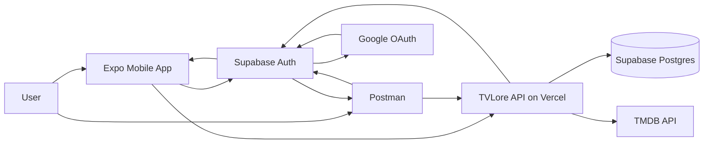
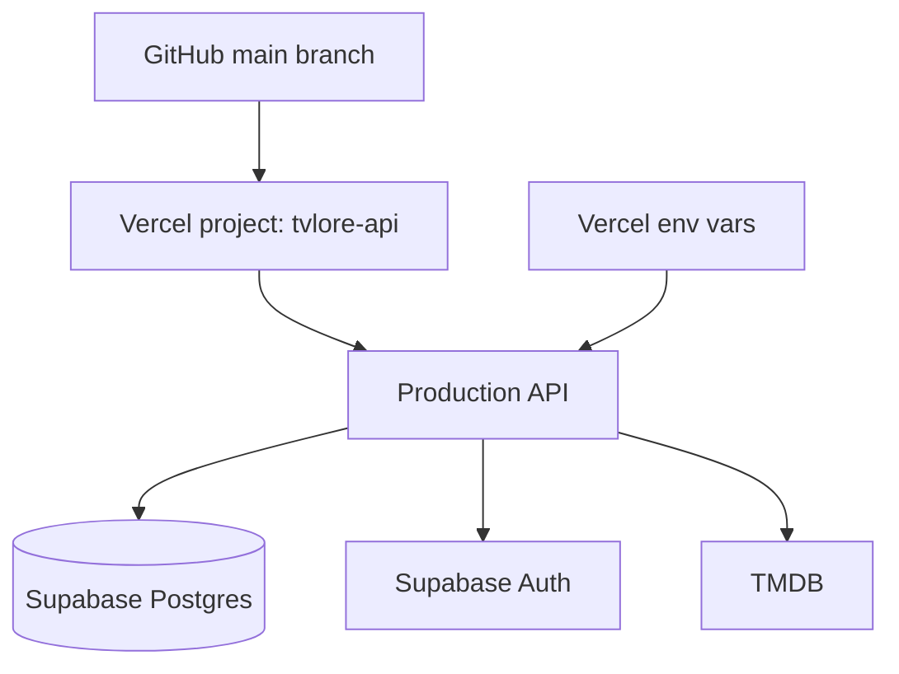
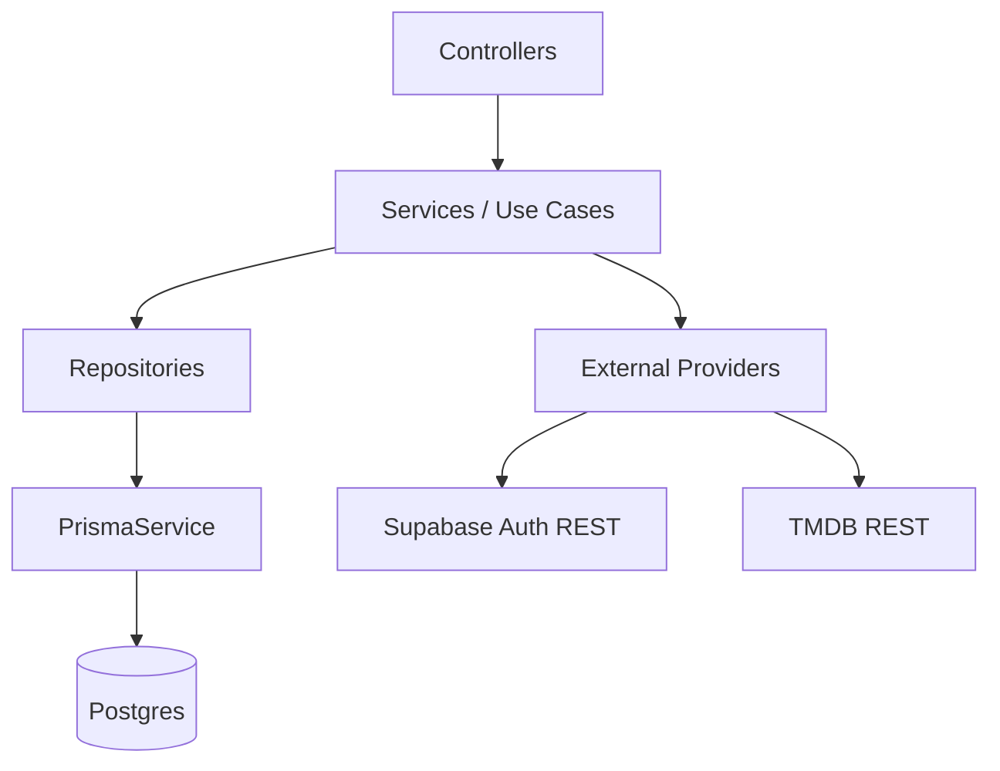
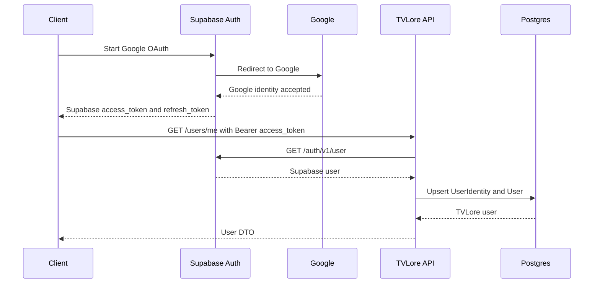
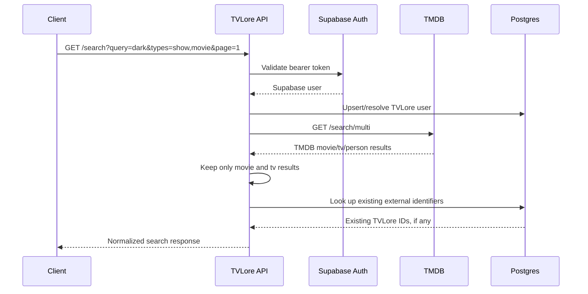
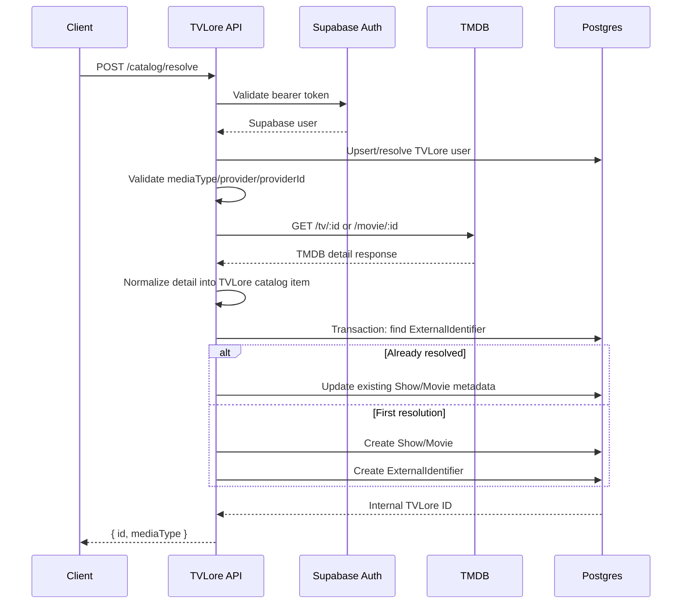
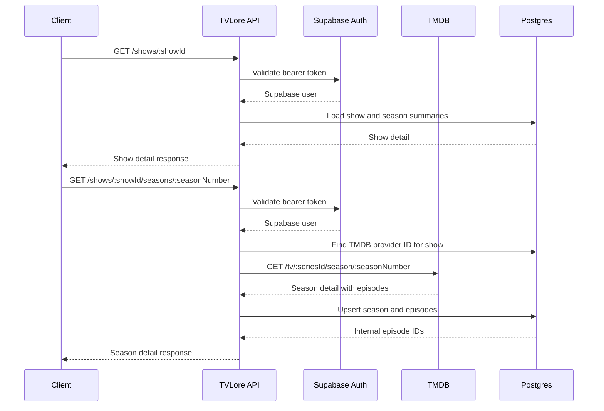
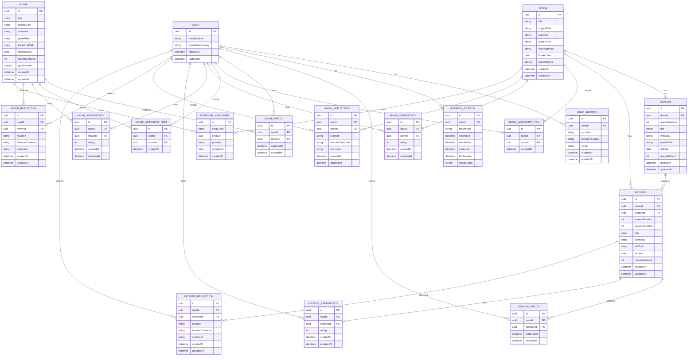

# Current State

This document explains what TVLore has implemented right now. It is intentionally practical: read it when you want to understand the current moving parts, request flows, database state, and what each piece is doing.

## 1. What Exists Today

Implemented:

- Monorepo with `apps/api`, `apps/mobile`, `packages/contracts`, and `docs`.
- NestJS backend deployed to Vercel at `https://tvlore-api.vercel.app`.
- Expo mobile app that can authenticate with Google through Supabase Auth.
- Supabase Postgres database connected to the backend through Prisma.
- Supabase Auth token validation in the backend.
- Authenticated `GET /users/me` and `PATCH /users/me`.
- User-owned streaming availability country preference.
- Authenticated `GET /search` backed by TMDB.
- Authenticated `POST /catalog/resolve` that converts TMDB refs into TVLore internal IDs.
- Authenticated show/movie detail endpoints by internal TVLore ID.
- Authenticated show/movie watch-provider availability endpoints by country.
- Authenticated show/movie/episode cast endpoints by internal TVLore ID.
- Season list and season detail endpoints for shows.
- Episode catalog persistence when a season is opened.
- Episode detail endpoint by internal TVLore episode ID.
- Authenticated watch/unwatch endpoints for episodes and movies.
- Authenticated show-level watch/unwatch endpoint that hydrates seasons and updates all episode watches for the show.
- Authenticated watchlist endpoints for shows and movies.
- Authenticated rating preference endpoints for shows, movies, and episodes.
- Authenticated post-watch reflection endpoints for shows, movies, and episodes.
- Authenticated personal library and show progress read endpoints.
- Authenticated first-pass recommendation endpoint from stored ratings, hydrated catalog rows, persisted genre names, and country-aware streaming availability.
- Authenticated curated and user-owned Watch Paths endpoints with backend-owned ordered viewing lists.
- Authenticated Watch Path creation endpoint that persists personal TMDB-ref lists for the user.
- Authenticated Watch Path save-to-watchlist endpoint that resolves every path item and saves it for the user.
- Authenticated Watch Path detail includes per-user saved count and item saved state.
- Mobile Library/Profile routes read the authenticated user and personal library summary from the API.
- Mobile search resolves provider results and opens backend-owned show/movie detail screens.
- Mobile show detail opens backend-owned season episode lists.
- Mobile season episode rows open backend-owned episode detail screens.
- Mobile search result rows, show season rows, and season episode rows navigate by tapping the full row.
- Mobile show detail displays backend-owned progress state for persisted episodes.
- Mobile season detail can mark episodes watched or unwatched.
- Mobile season detail can mark all loaded season episodes watched or unwatched.
- Mobile episode detail can mark an episode watched or unwatched.
- Mobile episode detail can rate or clear a 1-5 episode preference.
- Mobile episode detail opens a dedicated post-watch check-in screen with rating, sensation, cast-based favorite character, and optional comment.
- Mobile show detail can mark the full show watched or unwatched through one backend-owned bulk action.
- Mobile show/movie detail can add or remove a title from the watchlist.
- Mobile show/movie detail can rate or clear a rating preference for a title.
- Mobile show/movie detail compares the TMDB public rating against the user's rating in a compact spoiler-aware row.
- Mobile show/movie detail opens a dedicated post-watch check-in screen after a movie or full show is marked watched.
- Mobile post-watch check-in loads cast lazily and lets the user pick a favorite character from cast photos, with manual text fallback only when the character is not listed.
- Mobile show/movie detail renders country-aware watch-provider icons using the user's saved country preference.
- Mobile tracking mutations invalidate the local library data.
- Mobile watchlist mutations invalidate the local library data.
- Mobile Library/Profile refresh authenticated library data after tracking changes.
- Mobile Search can show a `Recommended picks` entry that opens backend-owned recommendation candidates, while visible streaming availability stays in detail screens.
- Mobile recommendation rows can explain preferred-genre overlap when the suggestion shares genres with highly rated titles.
- Mobile recommendation rows can save titles directly to the watchlist with optimistic feedback.
- Mobile Library shows watchlist titles and rated titles separately from watched history.
- Mobile Library summary cards filter Cronologia, continuing shows, recently watched movies, watched episodes grouped by show and season, watchlist, and rated titles.
- Mobile Cronologia loads a backend-owned paginated movie/episode watch-history feed.
- Mobile Library rows render catalog poster thumbnails when available, with stable placeholders otherwise.
- Mobile Library grouped episode rows open episode detail; their season headings open season detail and keep a separate expand/collapse control.
- Mobile Profile renders a touch-driven holo profile card with Google avatar and library stats.
- Mobile Profile lets the user choose the watch-provider country with flag labels.
- Mobile library rows navigate back to movie detail, show season detail, or episode detail screens depending on the row type.
- Mobile Library rows can remove watchlist items and undo recent watched markers through confirmable swipe actions.
- Mobile Library applies optimistic row removal after swipe confirmation and rolls back on API error.
- Mobile Library/Profile keep previous library data during refreshes and render skeletons on initial load.
- Mobile has routed Library, Search, Paths, and Profile surfaces with persistent bottom app navigation.
- Mobile Paths lists curated and personal viewing orders and opens path items through the existing catalog resolve flow.
- Mobile Paths can create a personal path from simple TMDB import lines.
- Mobile path detail can save a full path to watchlist in one action.
- Mobile path detail rows render poster thumbnails.
- Postman collection and local/Vercel environments.
- Environment validation for local and Vercel.
- Backend unit tests with Vitest.
- HTTP contract smoke checks through `corepack pnpm api:check`.

Not implemented yet:

- Social matching.
- Richer recommendation ranking with collaborative or deeper behavior signals.

## 2. Current System Diagram



What this means:

- The client gets a Supabase session through Google.
- The client calls TVLore with `Authorization: Bearer <supabase_access_token>`.
- The backend validates that token against Supabase Auth.
- The backend owns product data in Postgres.
- The backend calls TMDB with `TMDB_ACCESS_TOKEN`.
- The mobile app and Postman never receive the TMDB token.

## 3. Runtime Infrastructure



Current production target:

```text
https://tvlore-api.vercel.app
```

Required backend environment variables:

```text
DATABASE_URL
MIGRATE_DATABASE_URL
SUPABASE_URL
SUPABASE_PUBLISHABLE_KEY
TMDB_ACCESS_TOKEN
```

Why they exist:

- `DATABASE_URL`: runtime database connection from the API.
- `MIGRATE_DATABASE_URL`: direct database connection for Prisma migrations.
- `SUPABASE_URL`: Supabase project URL used to validate access tokens.
- `SUPABASE_PUBLISHABLE_KEY`: Supabase public key used by backend token validation calls.
- `TMDB_ACCESS_TOKEN`: server-side TMDB API Read Access Token.

## 4. Backend Shape



Current backend modules:

- `auth`: validates bearer tokens against Supabase.
- `users`: resolves the authenticated Supabase user into a TVLore user.
- `catalog`: searches TMDB, resolves TMDB items, and persists TVLore catalog IDs.
- `preferences`: stores explicit per-user ratings for shows, movies, and episodes.
- `watch-paths`: exposes backend-owned curated and user-owned viewing lists, persists imported user paths, hydrates existing TVLore IDs, and marks item saved state for the authenticated user.
- `health`: verifies API and database availability.
- `config`: loads and validates environment variables at startup.

The current pattern is:

```text
Controller -> Service -> Repository or Provider -> External System
```

Why this matters:

- Controllers stay thin and HTTP-focused.
- Services coordinate use cases.
- Repositories own database writes and transactions.
- Providers isolate external systems like Supabase Auth and TMDB.
- Pure mapping/parsing functions are unit tested.

## 5. Authentication Flow



Implemented endpoint:

```text
GET /users/me
PATCH /users/me
```

What it does:

1. Reads the `Authorization` header.
2. Extracts the bearer token.
3. Calls Supabase Auth to validate the token.
4. Maps the Supabase user into an internal authenticated-user shape.
5. Upserts `user_identities`.
6. Upserts or updates `users`.
7. Returns the TVLore user.

`PATCH /users/me` additionally validates and stores user settings such as the two-letter `availabilityCountry` used by watch-provider lookups.

Important detail:

Supabase owns login/session issuance today. TVLore owns the internal user record once a valid Supabase user reaches the backend.

## 6. Catalog Search Flow



Implemented endpoint:

```text
GET /search
```

Request example:

```text
GET /search?query=dark&types=show,movie&page=1
```

Response shape:

```json
{
  "page": 1,
  "query": "dark",
  "results": [
    {
      "mediaType": "show",
      "title": "Dark",
      "year": 2017,
      "overview": "A missing child sets four families on a frantic hunt for answers.",
      "posterPath": "/apbrbWs8M9lyOpJYU5WXrpFbk1Z.jpg",
      "externalRef": {
        "provider": "tmdb",
        "providerId": "70523"
      },
      "tvloreId": null
    }
  ]
}
```

What `tvloreId` means:

- `null`: result exists only as a TMDB-backed search result.
- UUID: result has already been resolved into a TVLore internal catalog record.

Why search does not immediately persist every result:

- Search can return many irrelevant results.
- Persisting only on interaction keeps the DB small.
- The user must choose a title before TVLore creates durable internal identity.

## 7. Catalog Resolve Flow



Implemented endpoint:

```text
POST /catalog/resolve
```

Request example:

```json
{
  "mediaType": "show",
  "provider": "tmdb",
  "providerId": "70523"
}
```

Response example:

```json
{
  "id": "tvlore-uuid",
  "mediaType": "show"
}
```

What it does:

1. Validates the Supabase access token.
2. Validates the request body.
3. Calls the TMDB detail endpoint.
4. Normalizes TMDB detail into a TVLore catalog item.
5. Opens a database transaction.
6. Checks `external_identifiers` for an existing mapping.
7. If found, updates existing metadata and returns the existing internal ID.
8. If missing, creates a `show` or `movie`.
9. Creates the matching `external_identifier`.
10. Returns the internal TVLore ID.

Why this endpoint matters:

Search gives us provider refs. Resolve gives us product identity. Watch history should reference TVLore UUIDs, not TMDB IDs.

## 8. Catalog Detail Flow



Implemented endpoints:

```text
GET /shows/:showId
GET /shows/:showId/watch-providers
GET /shows/:showId/seasons
GET /shows/:showId/seasons/:seasonNumber
GET /movies/:movieId
GET /movies/:movieId/watch-providers
POST /episodes/:episodeId/watches
DELETE /episodes/:episodeId/watches
POST /shows/:showId/watches
DELETE /shows/:showId/watches
POST /shows/:showId/seasons/:seasonNumber/watches
DELETE /shows/:showId/seasons/:seasonNumber/watches
POST /movies/:movieId/watches
DELETE /movies/:movieId/watches
POST /shows/:showId/watchlist
DELETE /shows/:showId/watchlist
POST /movies/:movieId/watchlist
DELETE /movies/:movieId/watchlist
PUT /shows/:showId/preference
DELETE /shows/:showId/preference
PUT /movies/:movieId/preference
DELETE /movies/:movieId/preference
PUT /episodes/:episodeId/preference
DELETE /episodes/:episodeId/preference
PUT /shows/:showId/reflection
PUT /movies/:movieId/reflection
PUT /episodes/:episodeId/reflection
GET /shows/:showId/progress
GET /library
GET /library/chronology
GET /recommendations
GET /watch-paths
GET /watch-paths/:pathId
POST /watch-paths/:pathId/watchlist
```

Current watched-state behavior:

- Movies return `watched`, `watchCount`, and `lastWatchedAt` for the authenticated user.
- Episodes return `watched`, `watchCount`, and `lastWatchedAt` for the authenticated user.
- Mark watched/unwatched is idempotent in the MVP: one active row per user/movie or user/episode.
- Show-level mark watched/unwatched is a backend-owned bulk action. Mark watched hydrates all non-empty seasons first, then upserts one watch row per episode for the authenticated user.
- Add/remove watchlist is idempotent in the MVP: one active row per user/show or user/movie.
- Rating preferences are explicit and separate from watched state: one active row per user/show, user/movie, or user/episode, with `rating` from 1 to 5.
- Post-watch reflections are explicit and separate from watched state: one active row per user/show, user/movie, or user/episode, with reaction, optional favorite character, and optional comment.
- Reflection writes also update the matching 1-5 rating preference so recommendations and library rating summaries continue reading the preference model.
- Show progress returned by show detail, episode watch mutations, and `GET /shows/:showId/progress` is based on episodes currently persisted in TVLore. Opening a season hydrates its episode rows.
- Show detail returns `progress.status` as `not_started`, `watching`, or `completed`.
- Show and movie detail responses return `inWatchlist`, nullable authenticated-user `rating`, and nullable TMDB `publicRating`. Episode detail responses return nullable authenticated-user `rating`.
- Show, movie, and episode detail responses return nullable authenticated-user `reflection` data when the user has saved a post-watch check-in.
- `GET /library` returns summary counts, continue-watching shows, rated titles, recent movie/episode activity, full watched episode activity, and watchlist titles for the authenticated user.
- `GET /shows/:showId/watch-providers` and `GET /movies/:movieId/watch-providers` return subscription/rent/buy/free availability for a country code using TMDB Watch Providers data; mobile now sends the authenticated user's saved `availabilityCountry`.

Why season detail fetches TMDB:

- Show resolve persists season summaries, not every episode.
- Opening a season is the first point where the user needs episode IDs.
- This avoids pulling every episode for every season during search or resolve.

## 9. Current Database Model



Current tables:

Production Supabase has applied `20260816161000_add_watch_reflections`, so the
reflection tables below are available at runtime.

- `users`: TVLore account/profile row, including the saved streaming availability country.
- `user_identities`: links a TVLore user to Supabase Auth.
- `refresh_sessions`: exists for the originally planned TVLore-owned refresh-token model; Supabase owns sessions in the current MVP.
- `shows`: internal TVLore show records created by resolve, including persisted TMDB genre names.
- `movies`: internal TVLore movie records created by resolve, including persisted TMDB genre names.
- `seasons`: internal TVLore season records created from TMDB show details.
- `episodes`: internal TVLore episode records created when a season is opened.
- `external_identifiers`: maps TVLore IDs to provider refs like `tmdb:70523`.
- `episode_watches`: per-user watched marker for an episode.
- `movie_watches`: per-user watched marker for a movie.
- `show_watchlist_items`: per-user saved-intent marker for a show.
- `movie_watchlist_items`: per-user saved-intent marker for a movie.
- `show_preferences`: per-user 1-5 rating preference for a show.
- `movie_preferences`: per-user 1-5 rating preference for a movie.
- `episode_preferences`: per-user 1-5 rating preference for an episode.
- `show_reflections`: per-user private post-watch reflection for a show.
- `movie_reflections`: per-user private post-watch reflection for a movie.
- `episode_reflections`: per-user private post-watch reflection for an episode.

Important constraint:

```text
external_identifiers(entity_type, provider, provider_id) is unique
episode_watches(user_id, episode_id) is unique
movie_watches(user_id, movie_id) is unique
show_watchlist_items(user_id, show_id) is unique
movie_watchlist_items(user_id, movie_id) is unique
show_preferences(user_id, show_id) is unique
movie_preferences(user_id, movie_id) is unique
episode_preferences(user_id, episode_id) is unique
show_reflections(user_id, show_id) is unique
movie_reflections(user_id, movie_id) is unique
episode_reflections(user_id, episode_id) is unique
```

Why:

- A TMDB show ID should resolve to exactly one TVLore show ID.
- Repeated resolve calls stay idempotent.
- Watch tracking references stable TVLore UUIDs.
- Repeated mark-watched calls stay idempotent.
- Watchlist tracking references stable TVLore UUIDs.
- Repeated add-to-watchlist calls stay idempotent.
- Rating preferences reference stable TVLore UUIDs.
- Repeated rating calls update the same preference row.
- Reflection rows reference stable TVLore UUIDs.
- Repeated reflection calls update the same private reflection row and the same rating preference row.
- Watched state belongs to a user, not to the catalog row.

Implementation note:

`external_identifiers.entity_id` is a logical polymorphic reference. It can point to a `show` or a `movie` depending on `entity_type`. There is no direct database foreign key for this polymorphic relation today; consistency is enforced in `CatalogRepository` inside the resolve transaction.

## 10. Postman Test Path

```mermaid
flowchart TB
  Env[Select TVLore Vercel environment]
  Login[Auth / Supabase / Open Google OAuth URL]
  Token[Paste access_token into supabaseAccessToken Current value]
  Validate[Auth / Supabase / GET Supabase user]
  Me[Users / GET /users/me]
  UserCountry[Users / PATCH /users/me availability country]
  Search[Catalog / GET /search]
  ResolveShow[Catalog / POST /catalog/resolve show]
  Show[Catalog / GET /shows/:showId]
  Seasons[Catalog / GET /shows/:showId/seasons]
  Season[Catalog / GET /shows/:showId/seasons/1]
  EpisodeRating[Preferences / PUT /episodes/:episodeId/preference]
  EpisodeWatch[Tracking / POST /episodes/:episodeId/watches]
  Progress[Library / GET /shows/:showId/progress]
  EpisodeUnwatch[Tracking / DELETE /episodes/:episodeId/watches]
  ResolveMovie[Catalog / POST /catalog/resolve movie]
  Movie[Catalog / GET /movies/:movieId]
  MovieWatch[Tracking / POST /movies/:movieId/watches]
  ShowWatchlist[Watchlist / POST /shows/:showId/watchlist]
  ShowRating[Preferences / PUT /shows/:showId/preference]
  MovieWatchlist[Watchlist / POST /movies/:movieId/watchlist]
  MovieRating[Preferences / PUT /movies/:movieId/preference]
  Library[Library / GET /library]
  Recommendations[Recommendations / GET /recommendations]
  ShowBulkWatch[Tracking / POST /shows/:showId/watches]
  ShowBulkUnwatch[Tracking / DELETE /shows/:showId/watches]
  MovieUnwatch[Tracking / DELETE /movies/:movieId/watches]

  Env --> Login
  Login --> Token
  Token --> Validate
  Validate --> Me
  Me --> UserCountry
  UserCountry --> Search
  Search --> ResolveShow
  ResolveShow --> Show
  Show --> ShowWatchlist
  ShowWatchlist --> ShowRating
  ShowRating --> Seasons
  Seasons --> Season
  Season --> EpisodeRating
  EpisodeRating --> EpisodeWatch
  EpisodeWatch --> Progress
  Progress --> EpisodeUnwatch
  EpisodeUnwatch --> ResolveMovie
  ResolveMovie --> Movie
  Movie --> MovieWatchlist
  MovieWatchlist --> MovieRating
  MovieRating --> MovieWatch
  MovieWatch --> Library
  Library --> Recommendations
  Recommendations --> ShowBulkWatch
  ShowBulkWatch --> ShowBulkUnwatch
  ShowBulkUnwatch --> MovieUnwatch
```



Expected behavior:

- `GET /health` and `GET /health/db` return `200` without auth.
- `GET /users/me`, `GET /search`, and `POST /catalog/resolve` return `401` without auth.
- `GET /users/me` returns the authenticated TVLore user with a valid Supabase token.
- `PATCH /users/me` updates the authenticated user's streaming availability country.
- `GET /search` returns normalized TMDB-backed results.
- `POST /catalog/resolve` returns a TVLore UUID.
- Running `GET /search` again after resolve should show `tvloreId` for the resolved item.
- `GET /shows/:showId` returns show detail and season summaries.
- `GET /shows/:showId/seasons/:seasonNumber` fetches and persists that season's episodes.
- `PUT /episodes/:episodeId/preference` stores a 1-5 episode rating for the authenticated user.
- `DELETE /episodes/:episodeId/preference` clears that episode rating for the authenticated user.
- `POST /episodes/:episodeId/watches` marks an episode watched for the authenticated user.
- `GET /shows/:showId/progress` returns show/season progress for the authenticated user.
- `DELETE /episodes/:episodeId/watches` marks that episode unwatched for the authenticated user.
- `POST /movies/:movieId/watches` marks a movie watched for the authenticated user.
- `POST /shows/:showId/watchlist` saves a show for later for the authenticated user.
- `DELETE /shows/:showId/watchlist` removes that saved show for the authenticated user.
- `POST /movies/:movieId/watchlist` saves a movie for later for the authenticated user.
- `DELETE /movies/:movieId/watchlist` removes that saved movie for the authenticated user.
- `PUT /shows/:showId/preference` stores a 1-5 show rating for the authenticated user.
- `DELETE /shows/:showId/preference` clears that show rating for the authenticated user.
- `PUT /movies/:movieId/preference` stores a 1-5 movie rating for the authenticated user.
- `DELETE /movies/:movieId/preference` clears that movie rating for the authenticated user.
- `PUT /shows/:showId/reflection`, `PUT /movies/:movieId/reflection`, and `PUT /episodes/:episodeId/reflection` save a private post-watch check-in and update the matching rating preference.
- `GET /library` returns personal summary, rated titles, continue-watching, watchlist, recently watched activity, and full watched episode activity.
- `GET /library/chronology` returns paginated personal movie/episode watch-history activity.
- `GET /recommendations` returns unrated, unwatched, unsaved catalog candidates ordered by the user's stronger rated media type, preferred genre matches, and streaming availability in the user's saved country.
- `GET /watch-paths` returns curated ordered viewing paths, and `GET /watch-paths/:pathId` returns path items with existing TVLore IDs plus per-user watchlist saved state when already resolved.
- `POST /watch-paths/:pathId/watchlist` resolves every path item and saves the resulting shows or movies to the authenticated user's watchlist.
- `POST /shows/:showId/watches` hydrates the show seasons, marks every episode watched, and returns completed show progress.
- `DELETE /shows/:showId/watches` removes every episode watch marker for that show and returns not-started show progress.
- `POST /shows/:showId/seasons/:seasonNumber/watches` hydrates that season, marks every episode in it watched, and returns show progress.
- `DELETE /shows/:showId/seasons/:seasonNumber/watches` removes every episode watch marker for that season and returns show progress.
- `DELETE /movies/:movieId/watches` marks that movie unwatched for the authenticated user.
- `GET /movies/:movieId` returns movie detail with authenticated user's watched state.
- `GET /shows/:showId/watch-providers?country=CL` and `GET /movies/:movieId/watch-providers?country=CL` return country-aware streaming availability buckets.

## 11. Mobile Frontend Slice

The current mobile app has these product-facing slices:

```text
Library
-> Supabase session
-> GET /users/me and GET /library in parallel
-> GET /library/chronology when Cronologia becomes visible
-> Library summary, watchlist, rated titles, continue-watching, recently-watched, paginated chronology

Profile
-> Supabase session
-> GET /users/me and GET /library in parallel
-> PATCH /users/me when the user changes availability country
-> Holo profile card, library stats, availability country, account state, sign out

Search
-> GET /search
-> GET /recommendations
-> Recommended picks route for the full recommendation list
-> POST /catalog/resolve
-> Show or movie detail route
-> GET /shows/:id or GET /movies/:id
-> Show detail progress state
-> Show/movie watchlist add/remove
-> Show/movie rating set/clear
-> Show/movie post-watch reflection save
-> GET /shows/:id/watch-providers or GET /movies/:id/watch-providers
-> Show-level watched/unwatched
-> Show season route
-> GET /shows/:id/seasons/:seasonNumber
-> Episode watch/unwatch
-> Episode post-watch reflection save

Paths
-> GET /watch-paths
-> POST /watch-paths when the user creates a personal path
-> GET /watch-paths/:pathId
-> POST /watch-paths/:pathId/watchlist when the user saves the full path
-> Tap path item
-> POST /catalog/resolve if the item does not already have a TVLore ID
-> Show or movie detail route
```

Current behavior:

- Signed-out users can start Google login.
- Signed-in users can refresh authenticated backend state.
- Library/Profile refresh avoids the public health check and loads only authenticated product data.
- Library shows watched counts for shows, movies, episodes, watchlist items, and rated titles.
- Profile shows library counts for shows, movies, episodes, and rated titles in a holo profile card.
- The profile card uses Google avatar metadata when available and initials as a fallback.
- Library shows continue-watching and recently watched rows when the backend has watched data.
- Library shows saved watchlist rows when the backend has watchlist data.
- Library shows rated show/movie rows when the backend has title-level rating preference data. Episode ratings live on episode detail for now.
- Search shows a `Recommended picks` entry when the backend has eligible catalog candidates; the dedicated recommendations route shows the full list. Availability is intentionally shown only after opening a title detail.
- Recommendation row copy can explain simple genre overlap, such as "Because you like Drama", from backend-provided preferred genres and item genres.
- Recommendation rows open the matching show or movie detail screen; watchlist actions stay on the detail screen.
- Library can filter from its summary cards between Cronologia, continuing shows, recently watched movies, watched episodes grouped by show and season, saved titles, and rated titles. Cronologia shows paginated watched movies and episodes by date.
- Episode groups keep each season collapsible so long watched histories stay scannable; the season label opens season detail and the +/- control expands or collapses the group.
- Library rows include compact poster thumbnails for quicker visual scanning.
- Continue-watching rows open the next season, recently watched movies open movie detail, and recently watched episodes open episode detail.
- Paths lists curated viewing orders such as Marvel Infinity Saga and Star Wars Skywalker Saga, plus personal paths created by the authenticated user.
- Paths can create a personal list from TMDB import lines such as `movie,155` or `show,70523,optional note`.
- Path detail rows navigate by tapping the full row and resolve the selected item into TVLore identity only when needed.
- Path detail can save all path titles into the user's watchlist through one backend-owned bulk action.
- Path detail shows how many path titles are already saved and marks saved rows.
- Watchlist rows can remove saved titles through confirmable swipe actions, and recently watched rows can undo the underlying movie or episode watched marker through confirmable swipe actions.
- Bottom app navigation connects Library, Search, Paths, and Profile from the root layout, so the tab bar stays stable while route content changes.
- Empty library state is expected after cleanup-oriented smoke checks.
- Search supports all/show/movie catalog filters.
- Search prefetches results with a debounce after the user enters at least three characters.
- Stale search responses are ignored so older results cannot overwrite newer queries.
- Search renders skeleton rows on initial loading and when filters change.
- Search keeps previous results visible during typed-query refreshes to avoid UI flicker.
- Search code is split into route/container, controls, recommendations, results, hook, and styles modules.
- Opening a search result resolves it into a TVLore ID before navigating.
- Detail screens render backend-owned show/movie data.
- Detail screens render content-shaped skeletons while show, movie, or season data loads.
- Show detail displays backend-owned progress state: not started, watching, or completed.
- Movie detail can mark a movie watched or unwatched.
- Movie watch actions update local detail state optimistically, then reconcile from the backend mutation response.
- Show detail can mark the full show watched or unwatched with one backend request and then reconcile progress from the backend mutation response.
- Show and movie detail can add or remove the title from the watchlist.
- Watchlist actions update local detail state optimistically, then reconcile from the backend mutation response.
- Show and movie detail can set or clear a 1-5 rating preference.
- Rating actions update local detail state optimistically, then reconcile from the backend mutation response.
- Show and movie detail render TMDB `publicRating` as `Spoiler` until the user rates the title or manually reveals it; the user's rating shows `--` until rated.
- After marking a movie, full show, or episode watched, mobile opens a dedicated post-watch check-in screen for rating, sensation, cast-based favorite character, and comment.
- Reflection saves optimistically update the local detail rating/reflection state, then reconcile from the backend mutation response.
- Profile lets the user choose the `Where to watch` country through flag-labelled country chips.
- Show and movie detail show `Where to watch` provider icons for the user's saved country preference, with device country and `CL` as fallback. Tapping a provider opens the title's TMDB/JustWatch availability link for that country.
- Show detail lists seasons and opens a season route.
- Season detail loads backend-owned episode IDs and watched state.
- Season detail can mark episodes watched or unwatched.
- Season detail can mark all currently loaded episodes watched or unwatched.
- Episode detail can rate or clear the selected episode with optimistic feedback.
- Tracking, watchlist, and rating mutations invalidate `GET /library`, so recent watch changes, saved intent, and rated titles appear without pressing Refresh when the user returns to Library or Profile.
- Episode watch actions update the touched episode and display returned show progress.

Why this shape matters:

- The mobile app owns presentation only.
- Supabase owns session storage and refresh.
- The backend owns product reads, progress, library calculations, and recommendation heuristics.
- The frontend now has a proven contract for authenticated library and tracking flows.

## 12. What We Proved

Infrastructure:

- Vercel can build and run the NestJS API.
- Vercel can reach Supabase Postgres.
- Vercel has the required backend env vars.
- Supabase Google login works.
- Postman can obtain a Supabase session through OAuth callback.
- TMDB access works from backend only.
- TMDB Watch Providers data can be returned by country without exposing TMDB credentials to mobile.

Backend architecture:

- Config is centralized and validated at startup.
- Errors use a consistent envelope with `code`, `message`, `details`, and `correlationId`.
- Requests emit JSON logs with method, route, status code, correlation ID, and latency in milliseconds.
- Auth token validation is isolated in `SupabaseAuthService`.
- User persistence is isolated in `UsersRepository`.
- TMDB HTTP and provider errors are isolated in `TmdbClient`.
- Catalog persistence is isolated in `CatalogRepository`.
- Tracking persistence is isolated in `TrackingRepository`.
- Watchlist persistence is isolated in `WatchlistRepository`.
- Library/progress reads are isolated in `LibraryRepository`.
- Search/resolve/detail parsing and mapping are pure functions with unit tests.
- `api:check` validates public health, protected-route errors, and authenticated product contracts when a Supabase token is supplied.

Product foundation:

- TVLore owns internal user IDs.
- TVLore owns internal catalog IDs.
- TMDB IDs are external references only.
- Watch tracking is stored against internal TVLore IDs and authenticated user IDs.
- Watchlist intent is stored against internal TVLore IDs and authenticated user IDs.
- Rating preferences are stored against internal TVLore IDs and authenticated user IDs.
- Post-watch reflections are stored against internal TVLore IDs and authenticated user IDs.
- Availability country is stored on the authenticated user's TVLore profile and reused by mobile detail screens.
- Genre names are persisted on resolved shows and movies from TMDB detail responses.
- TMDB public ratings are persisted on resolved shows and movies and lazily refreshed for older catalog rows that do not have one yet.
- Show progress status is calculated by the backend from persisted episode watches.
- Mobile can render backend-owned library data through the same Supabase token used by Postman.
- Mobile can search TMDB-backed catalog data without receiving TMDB credentials.
- Mobile can prefetch search results without prefetching database writes.
- Mobile can resolve a provider result and open internal show/movie details by TVLore ID.
- Mobile can open a backend-owned curated path and resolve individual path items into internal show/movie details.
- Mobile can mark movies watched/unwatched through backend tracking endpoints.
- Mobile can add/remove shows and movies from the watchlist through backend watchlist endpoints.
- Mobile can rate shows, movies, and episodes through backend preference endpoints.
- Mobile can save private post-watch reflections for shows, movies, and episodes through backend reflection endpoints.
- Mobile can remove watchlist/history rows immediately after swipe confirmation backed by existing backend watchlist and tracking endpoints.
- Mobile can render library thumbnails from existing poster data without extra API calls.
- Mobile can open a show season, hydrate episode IDs, and mark episodes watched/unwatched through backend tracking endpoints.
- Mobile can bulk-mark a loaded season through a backend-owned tracking endpoint instead of issuing one request per episode.
- Mobile can bulk-mark a full show through a backend-owned tracking endpoint instead of issuing one request per episode.
- Mobile has primary Library, Search, Paths, and Profile surfaces over the same authenticated API session.

## 13. Why This Backend Base Helps The Frontend

The frontend can stay simple because the backend already owns the hard parts:

- The app does not need TMDB credentials.
- The app does not need to know database structure.
- The app does not decide whether a provider item already exists internally.
- The app can call `GET /search`, show results, call `POST /catalog/resolve`, then navigate using a TVLore ID.

The frontend flow is now:

```text
Search screen
-> user selects result
-> POST /catalog/resolve
-> navigate to show/movie detail using TVLore ID
-> detail screen loads backend-owned details
-> show detail displays backend-owned progress status
-> detail screen can POST/DELETE watchlist state
-> movie detail can POST/DELETE /movies/:movieId/watches
-> show detail can POST/DELETE /shows/:showId/watches
-> show detail can navigate to a season
-> season detail can POST/DELETE /shows/:id/seasons/:seasonNumber/watches
-> season detail can POST/DELETE /episodes/:episodeId/watches
-> episode detail can PUT/DELETE /episodes/:episodeId/preference
-> detail screens can PUT /shows|movies|episodes/:id/reflection after watched state is saved
```

The remaining near-term frontend product flow is:

```text
Richer loading and mutation feedback
-> recommendation quality from stronger behavior signals
-> social matching after the personal library loop stays stable
```

## 14. Recommended Next Step

Add stronger recommendation signals from watch behavior:

```text
Track completed shows, watched movies, and ratings
-> derive preferred genres and media balance
-> tune recommendation reasons for "because you watched/rated X"
```

Why this is next:

- Watched history, watchlist, ratings, and bulk tracking now cover the core personal-library loop.
- Recommendations now use explicit ratings, hydrated catalog rows, genre names, and user-country streaming availability.
- Deeper behavior signals can improve suggestions without adding social complexity yet.
