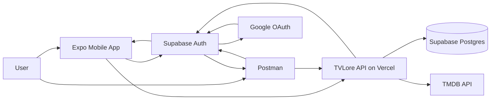
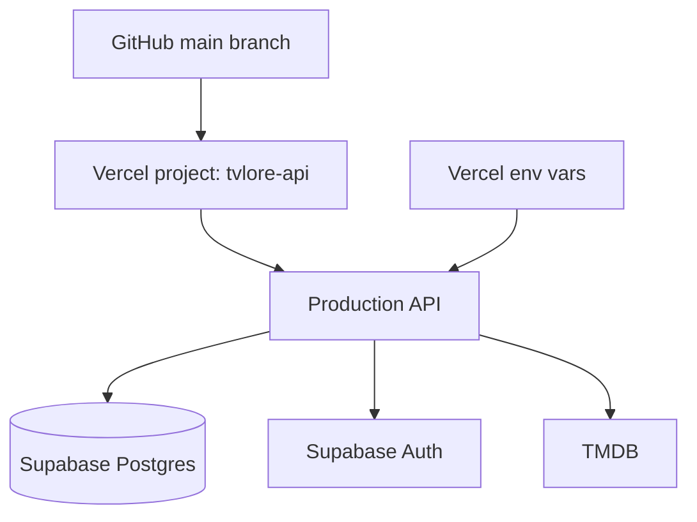
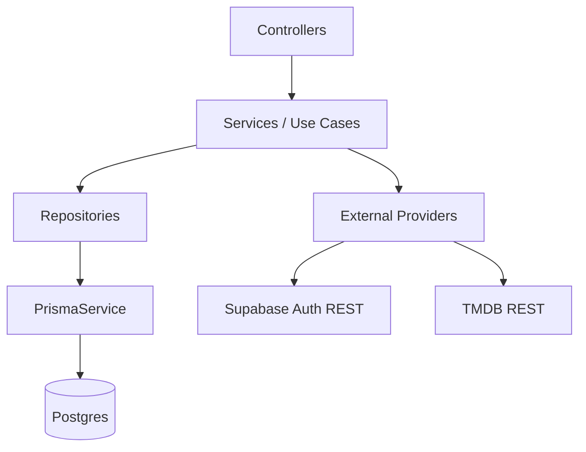
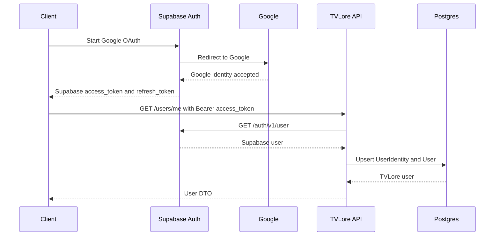
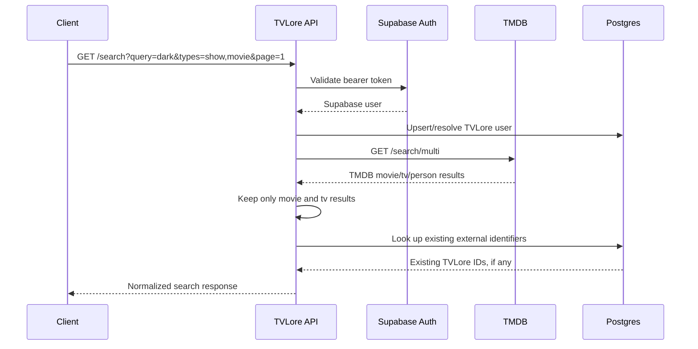
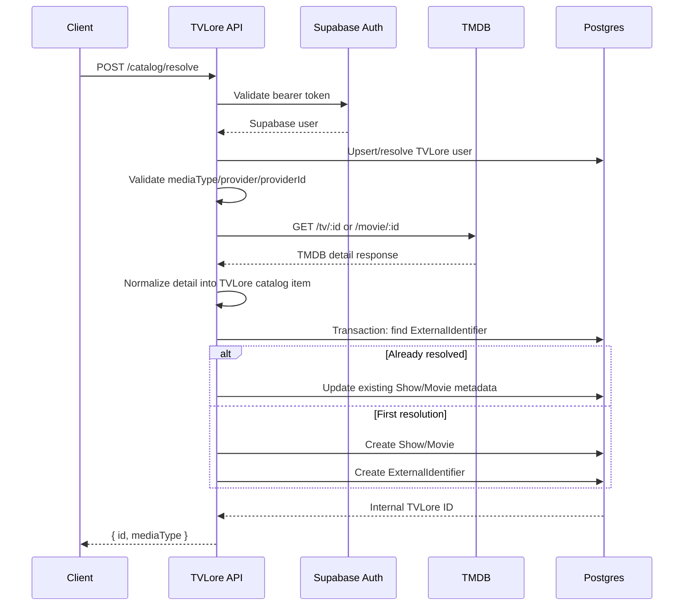
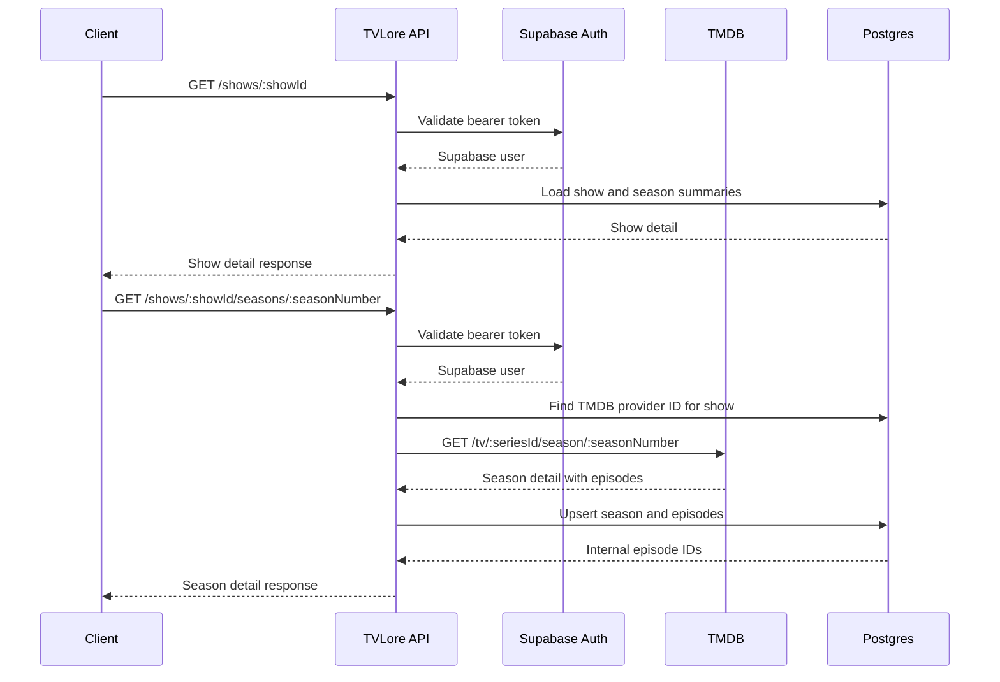
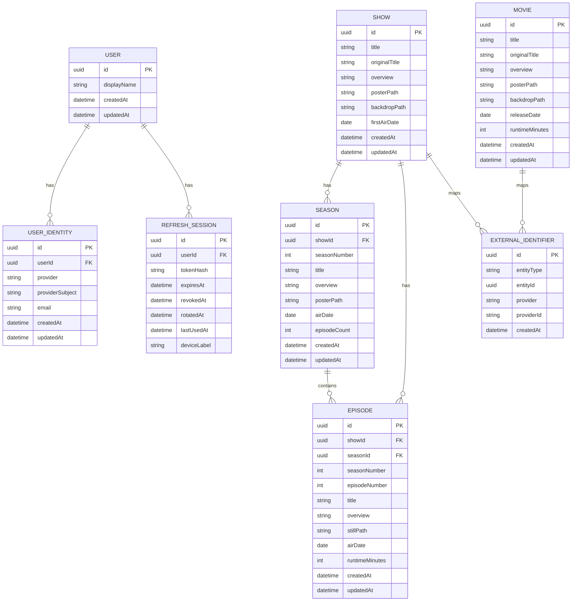
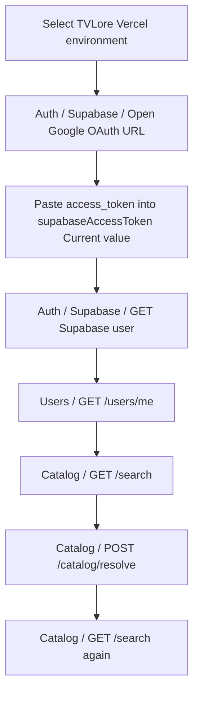

# Current State

This document explains what TVLore has implemented right now. It is intentionally practical: read it when you want to understand the current moving parts, request flows, database state, and what each piece is doing.

## 1. What Exists Today

Implemented:

- Monorepo with `apps/api`, `apps/mobile`, `packages/contracts`, and `docs`.
- NestJS backend deployed to Vercel at `https://tvlore-api.vercel.app`.
- Expo mobile app that can authenticate with Google through Supabase Auth.
- Supabase Postgres database connected to the backend through Prisma.
- Supabase Auth token validation in the backend.
- Authenticated `GET /users/me`.
- Authenticated `GET /search` backed by TMDB.
- Authenticated `POST /catalog/resolve` that converts TMDB refs into TVLore internal IDs.
- Authenticated show/movie detail endpoints by internal TVLore ID.
- Season list and season detail endpoints for shows.
- Episode catalog persistence when a season is opened.
- Postman collection and local/Vercel environments.
- Environment validation for local and Vercel.
- Backend unit tests with Vitest.

Not implemented yet:

- Watch/unwatch endpoints.
- Progress and personal library endpoints.
- Social matching.

## 2. Current System Diagram



What this means:

- The client gets a Supabase session through Google.
- The client calls TVLore with `Authorization: Bearer <supabase_access_token>`.
- The backend validates that token against Supabase Auth.
- The backend owns product data in Postgres.
- The backend calls TMDB with `TMDB_ACCESS_TOKEN`.
- The mobile app and Postman never receive the TMDB token.

## 3. Runtime Infrastructure



Current production target:

```text
https://tvlore-api.vercel.app
```

Required backend environment variables:

```text
DATABASE_URL
MIGRATE_DATABASE_URL
SUPABASE_URL
SUPABASE_PUBLISHABLE_KEY
TMDB_ACCESS_TOKEN
```

Why they exist:

- `DATABASE_URL`: runtime database connection from the API.
- `MIGRATE_DATABASE_URL`: direct database connection for Prisma migrations.
- `SUPABASE_URL`: Supabase project URL used to validate access tokens.
- `SUPABASE_PUBLISHABLE_KEY`: Supabase public key used by backend token validation calls.
- `TMDB_ACCESS_TOKEN`: server-side TMDB API Read Access Token.

## 4. Backend Shape



Current backend modules:

- `auth`: validates bearer tokens against Supabase.
- `users`: resolves the authenticated Supabase user into a TVLore user.
- `catalog`: searches TMDB, resolves TMDB items, and persists TVLore catalog IDs.
- `health`: verifies API and database availability.
- `config`: loads and validates environment variables at startup.

The current pattern is:

```text
Controller -> Service -> Repository or Provider -> External System
```

Why this matters:

- Controllers stay thin and HTTP-focused.
- Services coordinate use cases.
- Repositories own database writes and transactions.
- Providers isolate external systems like Supabase Auth and TMDB.
- Pure mapping/parsing functions are unit tested.

## 5. Authentication Flow



Implemented endpoint:

```text
GET /users/me
```

What it does:

1. Reads the `Authorization` header.
2. Extracts the bearer token.
3. Calls Supabase Auth to validate the token.
4. Maps the Supabase user into an internal authenticated-user shape.
5. Upserts `user_identities`.
6. Upserts or updates `users`.
7. Returns the TVLore user.

Important detail:

Supabase owns login/session issuance today. TVLore owns the internal user record once a valid Supabase user reaches the backend.

## 6. Catalog Search Flow



Implemented endpoint:

```text
GET /search
```

Request example:

```text
GET /search?query=dark&types=show,movie&page=1
```

Response shape:

```json
{
  "page": 1,
  "query": "dark",
  "results": [
    {
      "mediaType": "show",
      "title": "Dark",
      "year": 2017,
      "overview": "A missing child sets four families on a frantic hunt for answers.",
      "posterPath": "/apbrbWs8M9lyOpJYU5WXrpFbk1Z.jpg",
      "externalRef": {
        "provider": "tmdb",
        "providerId": "70523"
      },
      "tvloreId": null
    }
  ]
}
```

What `tvloreId` means:

- `null`: result exists only as a TMDB-backed search result.
- UUID: result has already been resolved into a TVLore internal catalog record.

Why search does not immediately persist every result:

- Search can return many irrelevant results.
- Persisting only on interaction keeps the DB small.
- The user must choose a title before TVLore creates durable internal identity.

## 7. Catalog Resolve Flow



Implemented endpoint:

```text
POST /catalog/resolve
```

Request example:

```json
{
  "mediaType": "show",
  "provider": "tmdb",
  "providerId": "70523"
}
```

Response example:

```json
{
  "id": "tvlore-uuid",
  "mediaType": "show"
}
```

What it does:

1. Validates the Supabase access token.
2. Validates the request body.
3. Calls the TMDB detail endpoint.
4. Normalizes TMDB detail into a TVLore catalog item.
5. Opens a database transaction.
6. Checks `external_identifiers` for an existing mapping.
7. If found, updates existing metadata and returns the existing internal ID.
8. If missing, creates a `show` or `movie`.
9. Creates the matching `external_identifier`.
10. Returns the internal TVLore ID.

Why this endpoint matters:

Search gives us provider refs. Resolve gives us product identity. Watch history should reference TVLore UUIDs, not TMDB IDs.

## 8. Catalog Detail Flow



Implemented endpoints:

```text
GET /shows/:showId
GET /shows/:showId/seasons
GET /shows/:showId/seasons/:seasonNumber
GET /movies/:movieId
```

Current watched-state behavior:

- Movies return `watched: false`, `watchCount: 0`, and `lastWatchedAt: null`.
- Episodes return `watched: false`, `watchCount: 0`, and `lastWatchedAt: null`.
- These fields are placeholders for the next tracking slice, where they will be derived per authenticated user.

Why season detail fetches TMDB:

- Show resolve persists season summaries, not every episode.
- Opening a season is the first point where the user needs episode IDs.
- This avoids pulling every episode for every season during search or resolve.

## 9. Current Database Model



Current tables:

- `users`: TVLore account/profile row.
- `user_identities`: links a TVLore user to Supabase Auth.
- `refresh_sessions`: exists for the originally planned TVLore-owned refresh-token model; Supabase owns sessions in the current MVP.
- `shows`: internal TVLore show records created by resolve.
- `movies`: internal TVLore movie records created by resolve.
- `seasons`: internal TVLore season records created from TMDB show details.
- `episodes`: internal TVLore episode records created when a season is opened.
- `external_identifiers`: maps TVLore IDs to provider refs like `tmdb:70523`.

Important constraint:

```text
external_identifiers(entity_type, provider, provider_id) is unique
```

Why:

- A TMDB show ID should resolve to exactly one TVLore show ID.
- Repeated resolve calls stay idempotent.
- Future tracking can reference stable TVLore UUIDs.

Implementation note:

`external_identifiers.entity_id` is a logical polymorphic reference. It can point to a `show` or a `movie` depending on `entity_type`. There is no direct database foreign key for this polymorphic relation today; consistency is enforced in `CatalogRepository` inside the resolve transaction.

## 10. Postman Test Path



Expected behavior:

- `GET /health` and `GET /health/db` return `200` without auth.
- `GET /users/me`, `GET /search`, and `POST /catalog/resolve` return `401` without auth.
- `GET /users/me` returns the authenticated TVLore user with a valid Supabase token.
- `GET /search` returns normalized TMDB-backed results.
- `POST /catalog/resolve` returns a TVLore UUID.
- Running `GET /search` again after resolve should show `tvloreId` for the resolved item.
- `GET /shows/:showId` returns show detail and season summaries.
- `GET /shows/:showId/seasons/:seasonNumber` fetches and persists that season's episodes.
- `GET /movies/:movieId` returns movie detail with default unwatched state until tracking exists.

## 11. What We Proved

Infrastructure:

- Vercel can build and run the NestJS API.
- Vercel can reach Supabase Postgres.
- Vercel has the required backend env vars.
- Supabase Google login works.
- Postman can obtain a Supabase session through OAuth callback.
- TMDB access works from backend only.

Backend architecture:

- Config is centralized and validated at startup.
- Errors use a consistent envelope with `code`, `message`, `details`, and `correlationId`.
- Auth token validation is isolated in `SupabaseAuthService`.
- User persistence is isolated in `UsersRepository`.
- TMDB HTTP and provider errors are isolated in `TmdbClient`.
- Catalog persistence is isolated in `CatalogRepository`.
- Search/resolve/detail parsing and mapping are pure functions with unit tests.

Product foundation:

- TVLore owns internal user IDs.
- TVLore owns internal catalog IDs.
- TMDB IDs are external references only.
- Watch tracking can now be built on top of internal IDs.

## 12. Why This Backend Base Helps The Frontend

The frontend can stay simple because the backend already owns the hard parts:

- The app does not need TMDB credentials.
- The app does not need to know database structure.
- The app does not decide whether a provider item already exists internally.
- The app can call `GET /search`, show results, call `POST /catalog/resolve`, then navigate using a TVLore ID.

The future frontend flow becomes:

```text
Search screen
-> user selects result
-> POST /catalog/resolve
-> navigate to show/movie detail using TVLore ID
-> detail screen loads backend-owned details
-> show season screen loads backend-owned episode IDs
-> tracking buttons call backend-owned watch endpoints
```

## 13. Recommended Next Step

Build the tracking layer:

```text
POST /episodes/:episodeId/watches
DELETE /episodes/:episodeId/watches
POST /movies/:movieId/watches
DELETE /movies/:movieId/watches
```

Why this is next:

- We now have internal movie IDs.
- We now have internal episode IDs after opening a season.
- Watched state belongs to a user, so it should be stored in `movie_watches` and `episode_watches`, not on catalog rows.
