# Diagrams

Mermaid diagrams are written for GitHub Markdown compatibility.

## 1. TVLore System Context

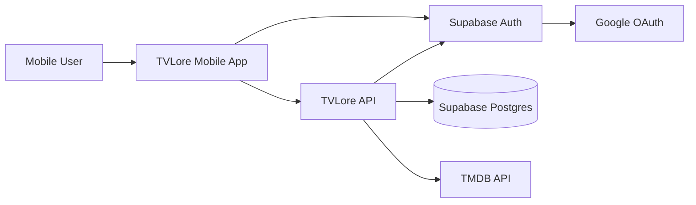

## 2. Mobile/API/TMDB/PostgreSQL Architecture

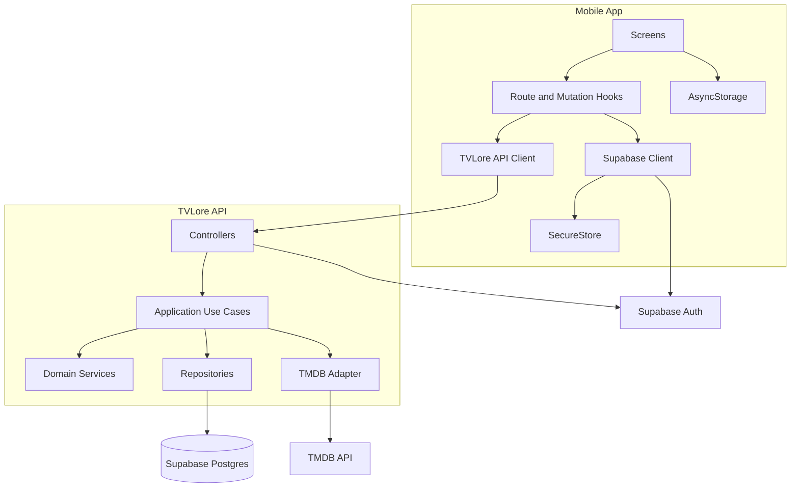

## 3. Supabase Google Authentication Flow

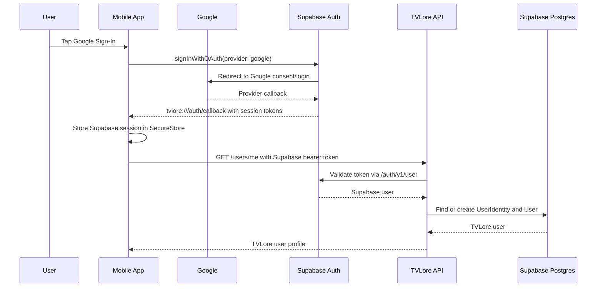

## 4. Supabase Session Refresh and API Validation Flow

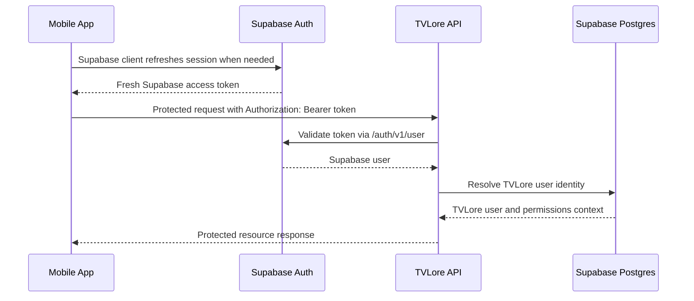

## 5. Show Search Flow

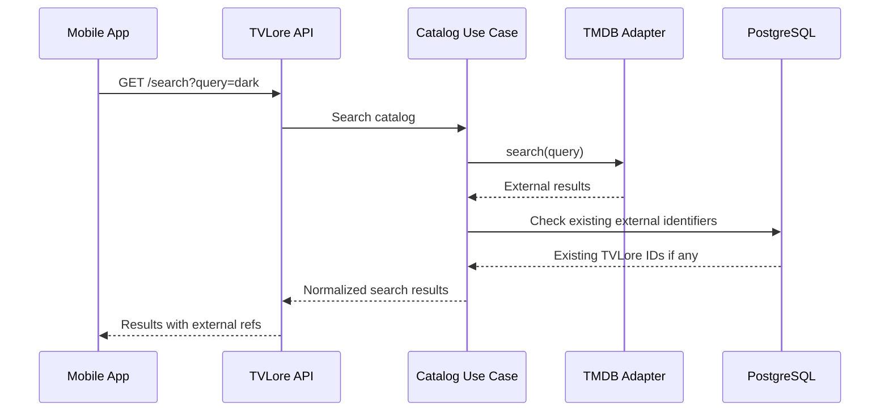

## 6. Show Detail Flow

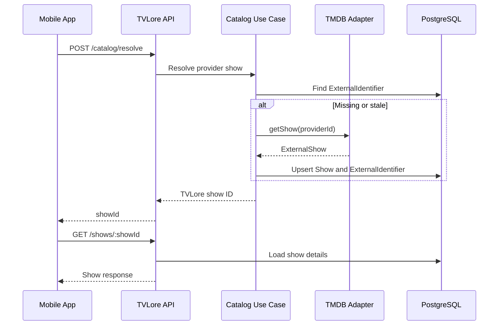

## 7. Mark Episode Watched Flow

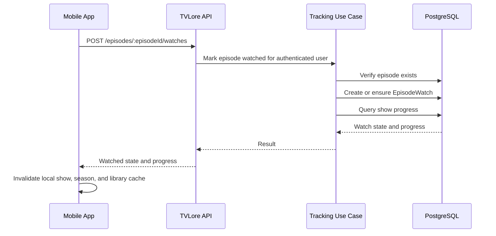

## 8. Mark Movie Watched Flow

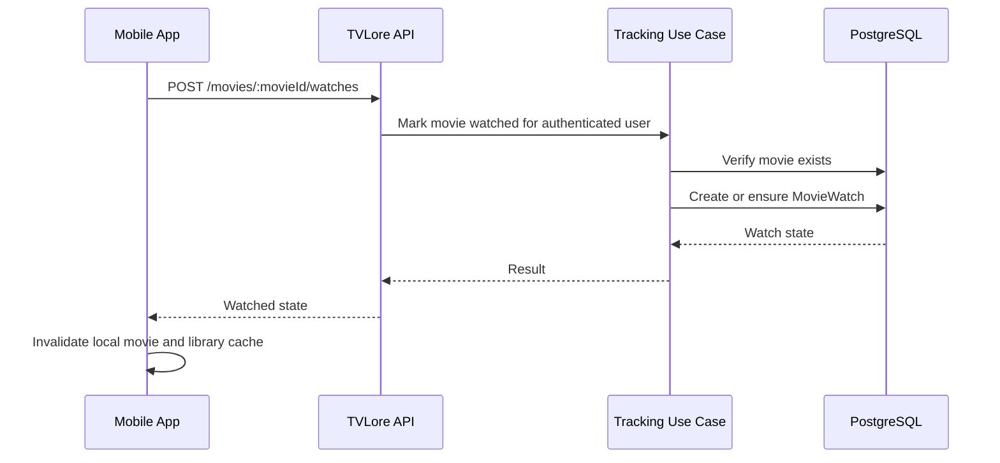

## 9. State Ownership

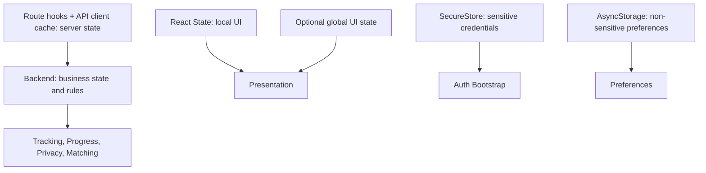

## 10. Core Database ER Model

`REFRESH_SESSION` remains in the schema from the earlier custom-token strategy,
but current MVP sessions are Supabase-managed. Do not build new authentication
behavior around it without an explicit auth architecture change.

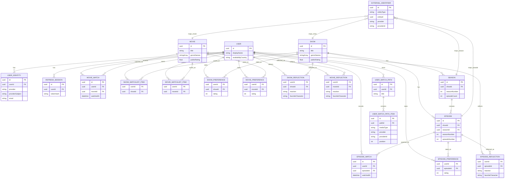

## 11. Future QR Match Flow

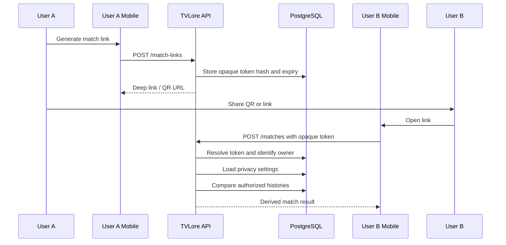

## 12. Future Social Domain Extension

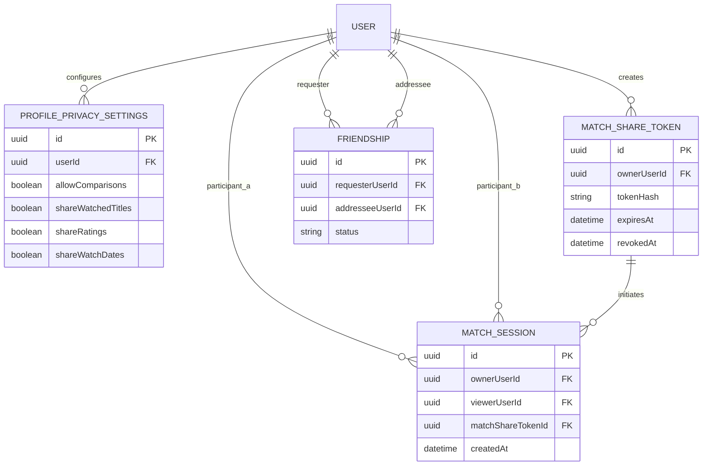

## 13. Trust/Security Boundaries

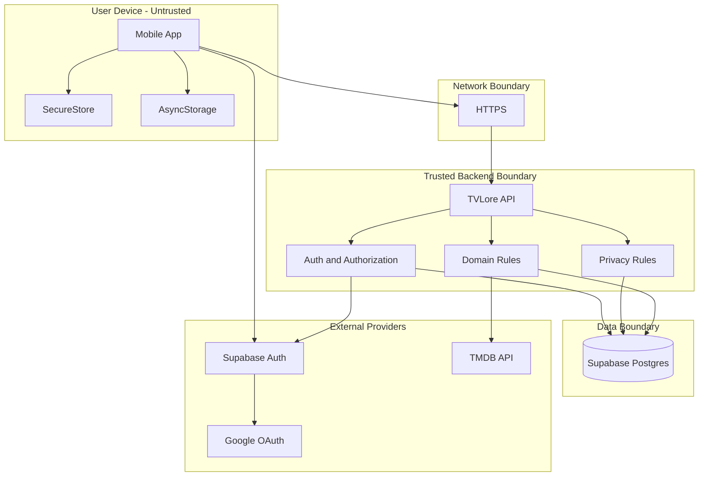
