# Diagrams

Mermaid diagrams are written for GitHub Markdown compatibility.

## 1. TVLore System Context

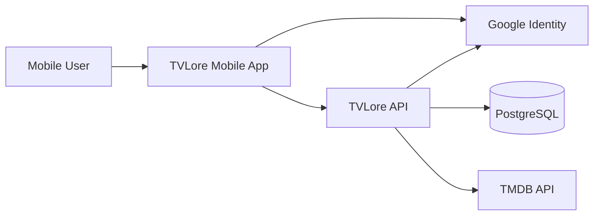

## 2. Mobile/API/TMDB/PostgreSQL Architecture

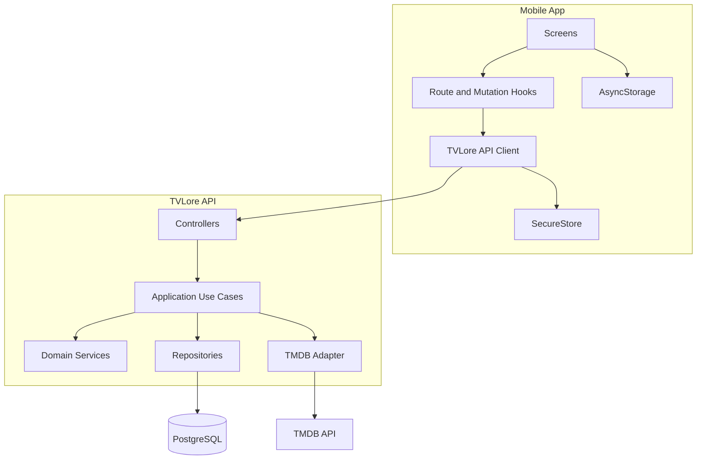

## 3. Google Authentication Flow

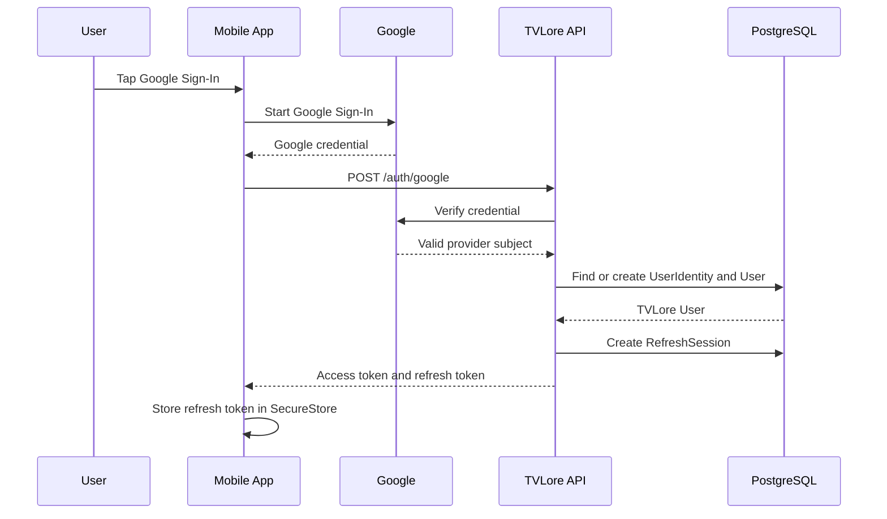

## 4. Token Refresh Flow

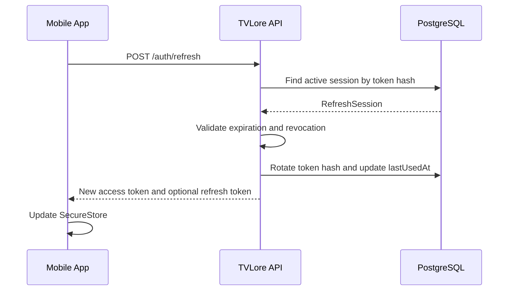

## 5. Show Search Flow

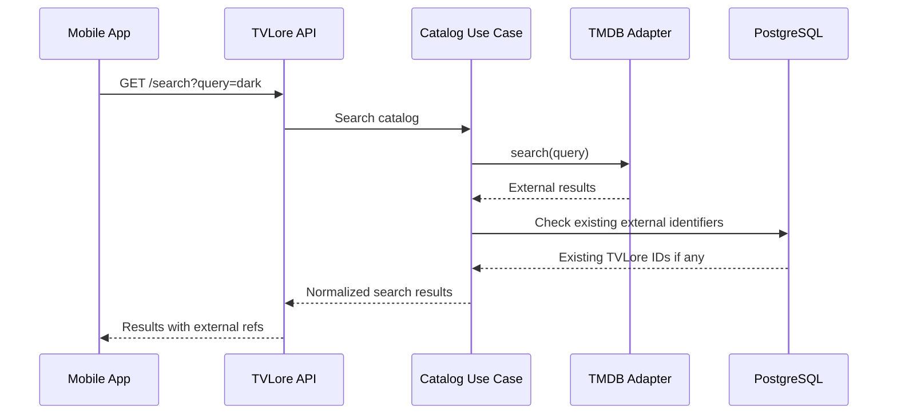

## 6. Show Detail Flow

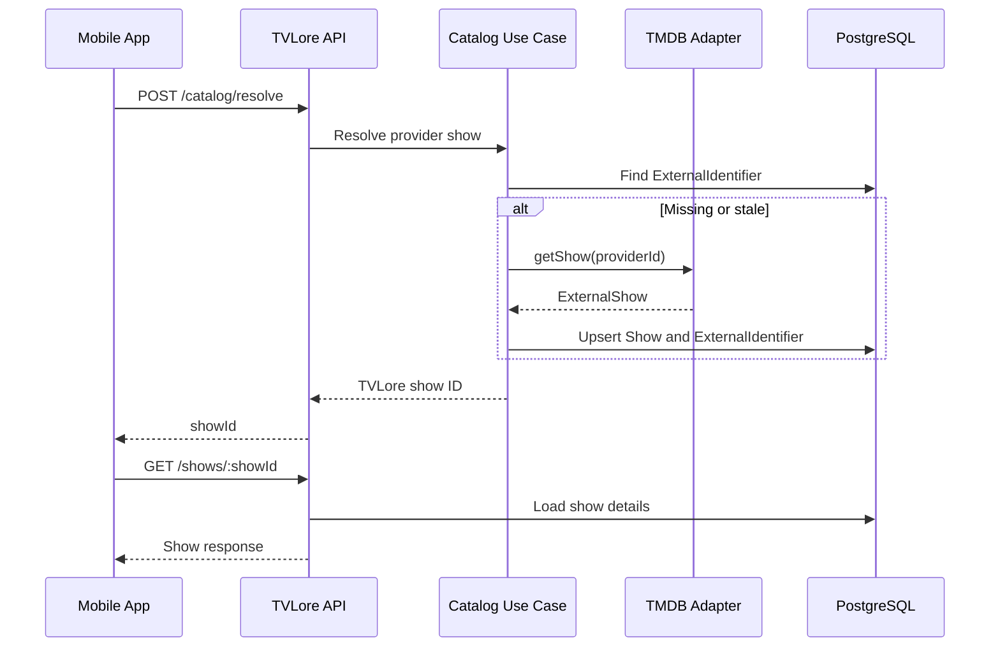

## 7. Mark Episode Watched Flow

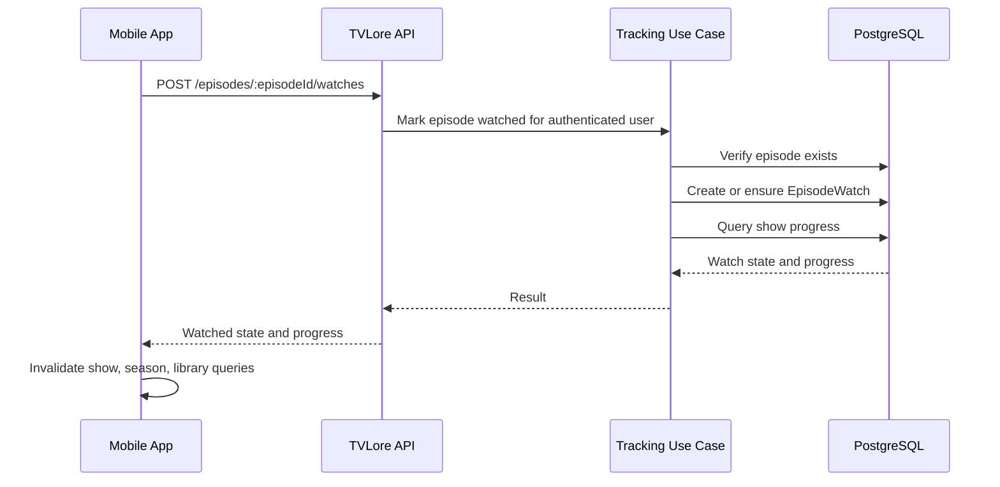

## 8. Mark Movie Watched Flow

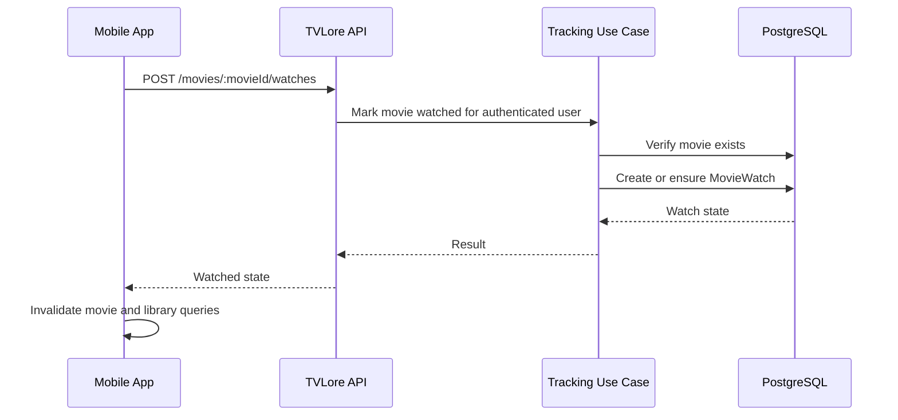

## 9. State Ownership

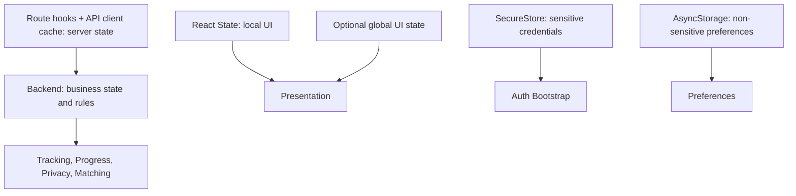

## 10. MVP Database ER Model

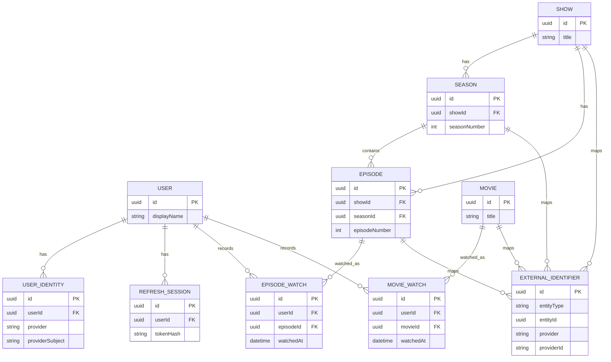

## 11. Future QR Match Flow

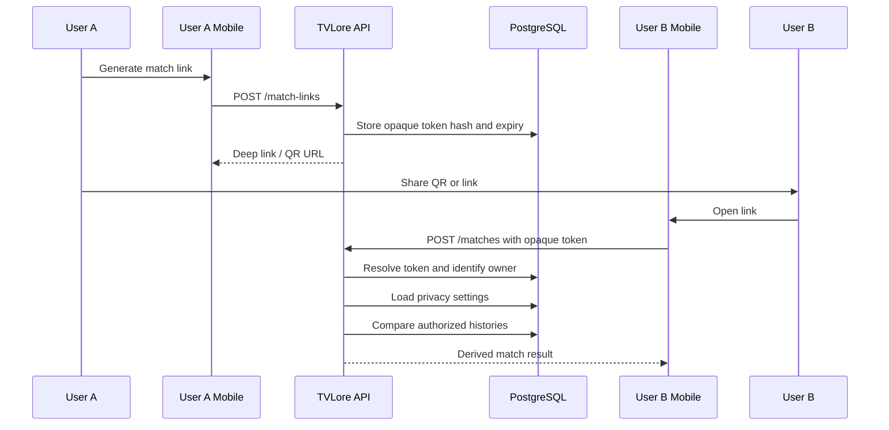

## 12. Future Social Domain Extension

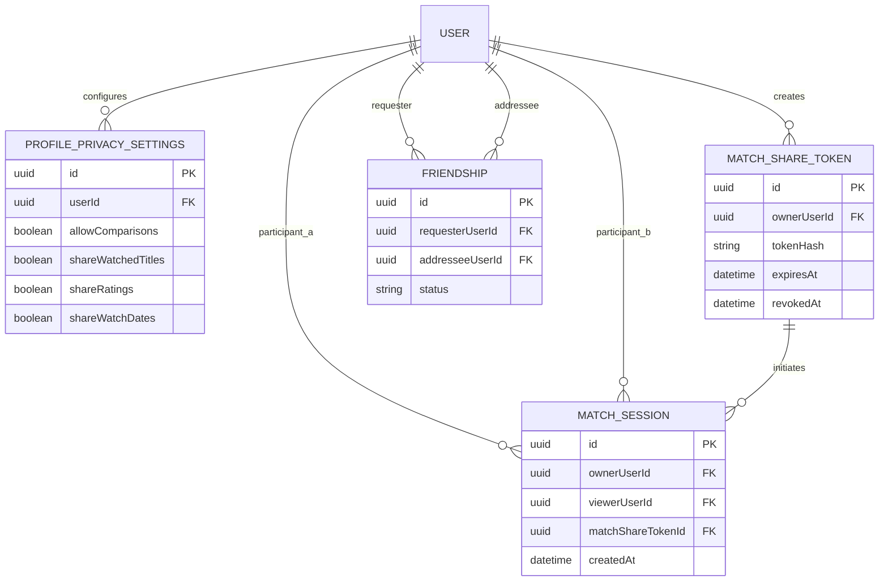

## 13. Trust/Security Boundaries

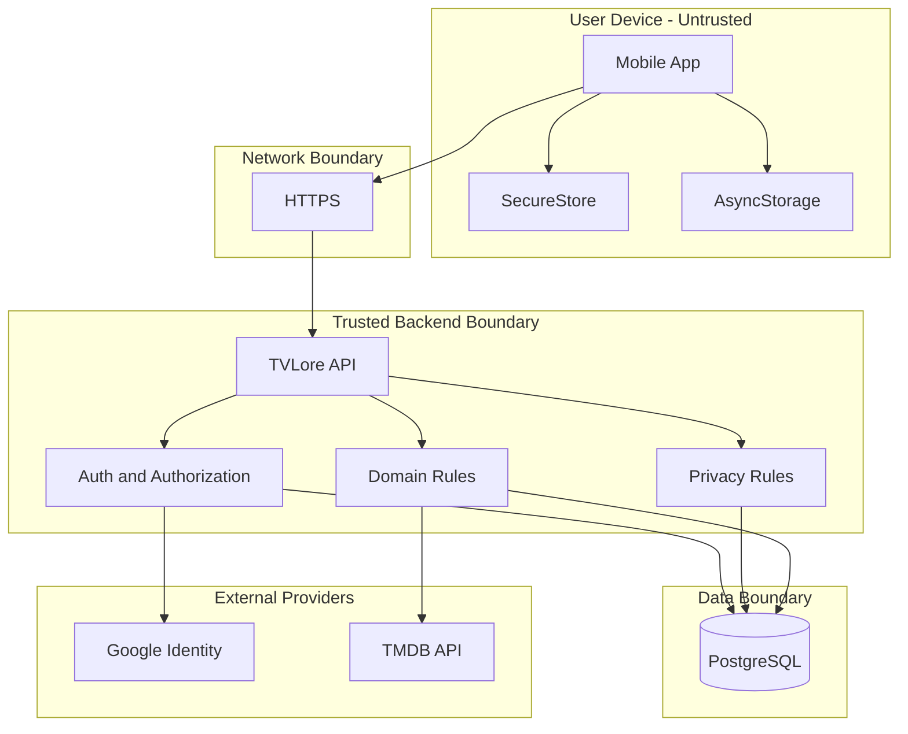
