# Domain Model

This document captures the conceptual modeling decisions. For the current
implemented table-by-table map, see [Data Model Map](data-model-map.md).

TVLore separates external catalog metadata from TVLore-owned product data.

## Data Ownership

### External Catalog/Provider Data

TMDB initially provides:

- TV shows.
- Movies.
- Titles.
- Descriptions.
- Posters.
- Backdrops.
- Genres.
- Season metadata.
- Episode metadata.
- Release/air dates.
- Cast information where needed.
- Provider metadata where useful.

### TVLore-Owned Data

TVLore owns:

- Users.
- Identities.
- Availability country.
- Viewing state.
- Watched timestamps.
- Show progress.
- Movie history.
- Ratings.
- Private post-watch reflections.
- Favorite-character selections.
- Watchlists.
- User-created watch paths.
- Imported watch paths.
- Future friendship relationships.
- Future match sessions.
- Future taste-profile data.
- Privacy settings.

Provider metadata should not determine application identity.

Current MVP rule:

```text
External providers describe titles.
TVLore owns what a signed-in user does with those titles.
```

## Internal Identifiers

TVLore entities should use internal UUIDs.

TMDB IDs must not be exposed as TVLore's permanent domain identity. Provider IDs are mappings, not primary identity.

Conceptual shape:

```text
Show
|-- id
|-- title
`-- externalIds
    |-- tmdb
    |-- imdb?
    `-- tvdb?

Movie
|-- id
|-- title
`-- externalIds
    |-- tmdb
    `-- imdb?
```

## Provider ID Storage Options

### Option A - Direct Provider Columns

Example:

```text
shows.tmdb_id
movies.tmdb_id
```

Pros:

- Simple queries.
- Easy uniqueness constraints.
- Fewer joins.

Cons:

- Couples schema to one provider.
- Adding IMDb/TVDB/Trakt mappings creates schema churn.
- Awkward when different entity types have different provider identifiers.

### Option B - ExternalIdentifier Table

Example:

```text
external_identifiers
|-- id
|-- entityType
|-- entityId
|-- provider
`-- providerId
```

Pros:

- Supports multiple providers.
- Keeps TVLore identity separate.
- Clean uniqueness per provider and entity type.
- Matches long-term catalog-provider boundary.

Cons:

- Adds joins.
- Requires careful constraints.
- Slightly more initial code.

### Recommendation

Use `ExternalIdentifier` for media catalog entities from the start. It is small enough for MVP and prevents TMDB IDs from becoming product identity.

## Current Entities

### User

Represents a TVLore account.

Fields:

- `id`
- `displayName`
- `availabilityCountry`
- `createdAt`
- `updatedAt`

### UserIdentity

Links a TVLore user to an external identity provider.

Fields:

- `id`
- `userId`
- `provider`
- `providerSubject`
- `email`
- `createdAt`
- `updatedAt`

Unique constraint:

- `(provider, providerSubject)`

### RefreshSession

Represents an early TVLore-owned refresh session. It remains in the schema from
the first custom-token design, but the current MVP session flow is managed by
Supabase Auth.

Fields:

- `id`
- `userId`
- `tokenHash`
- `createdAt`
- `expiresAt`
- `revokedAt`
- `rotatedAt`
- `lastUsedAt`
- `deviceLabel`

### Show

Internal TVLore show record. Created when a user interacts with or resolves a provider show.

Fields:

- `id`
- `title`
- `originalTitle`
- `overview`
- `posterPath`
- `backdropPath`
- `firstAirDate`
- `genreNames`
- `publicRating`
- `createdAt`
- `updatedAt`

### Season

Internal season record belonging to a show.

Fields:

- `id`
- `showId`
- `seasonNumber`
- `title`
- `overview`
- `posterPath`
- `airDate`
- `episodeCount`
- `createdAt`
- `updatedAt`

Unique constraint:

- `(showId, seasonNumber)`

### Episode

Internal episode record belonging to a season.

Fields:

- `id`
- `showId`
- `seasonId`
- `seasonNumber`
- `episodeNumber`
- `title`
- `overview`
- `stillPath`
- `airDate`
- `runtimeMinutes`
- `createdAt`
- `updatedAt`

Unique constraint:

- `(showId, seasonNumber, episodeNumber)`

### Movie

Internal movie record. Created when a user interacts with or resolves a provider movie.

Fields:

- `id`
- `title`
- `originalTitle`
- `overview`
- `posterPath`
- `backdropPath`
- `releaseDate`
- `runtimeMinutes`
- `genreNames`
- `publicRating`
- `createdAt`
- `updatedAt`

### EpisodeWatch

Represents one active watched marker for one user and one episode in the MVP.

Fields:

- `id`
- `userId`
- `episodeId`
- `watchedAt`
- `createdAt`

Unique constraint:

- `(userId, episodeId)`

Future rewatch history can relax this constraint and count multiple rows.

### MovieWatch

Represents one active watched marker for one user and one movie in the MVP.

Fields:

- `id`
- `userId`
- `movieId`
- `watchedAt`
- `createdAt`

Unique constraint:

- `(userId, movieId)`

Future rewatch history can relax this constraint and count multiple rows.

### ShowWatchlistItem

Represents a user's intent to watch a show later.

Fields:

- `id`
- `userId`
- `showId`
- `createdAt`

Unique constraint:

- `(userId, showId)`

### MovieWatchlistItem

Represents a user's intent to watch a movie later.

Fields:

- `id`
- `userId`
- `movieId`
- `createdAt`

Unique constraint:

- `(userId, movieId)`

### ShowPreference

Represents a user's show-level star rating.

Fields:

- `id`
- `userId`
- `showId`
- `rating`
- `createdAt`
- `updatedAt`

Unique constraint:

- `(userId, showId)`

### MoviePreference

Represents a user's movie-level star rating.

Fields:

- `id`
- `userId`
- `movieId`
- `rating`
- `createdAt`
- `updatedAt`

Unique constraint:

- `(userId, movieId)`

### EpisodePreference

Represents a user's episode-level star rating.

Fields:

- `id`
- `userId`
- `episodeId`
- `rating`
- `createdAt`
- `updatedAt`

Unique constraint:

- `(userId, episodeId)`

### ShowReflection, MovieReflection, EpisodeReflection

Represent a private post-watch check-in for a show, movie, or episode.

Fields:

- `id`
- `userId`
- media FK: `showId`, `movieId`, or `episodeId`
- `reaction`
- `favoriteCharacter`
- `comment`
- `createdAt`
- `updatedAt`

Unique constraint:

- One reflection per user and media item.

Current behavior:

- Re-submitting a reflection updates the existing row.
- Favorite-character percentages are not implemented yet; current selections
  are private user data.

### UserWatchPath

Represents a user-owned ordered viewing guide, such as an imported franchise
order or personal list.

Fields:

- `id`
- `userId`
- `title`
- `description`
- `createdAt`
- `updatedAt`

### UserWatchPathItem

Represents one ordered provider reference inside a user watch path.

Fields:

- `id`
- `pathId`
- `mediaType`
- `provider`
- `providerId`
- `title`
- `note`
- `posterPath`
- `year`
- `position`
- `createdAt`

Unique constraints:

- `(pathId, position)`
- `(pathId, mediaType, provider, providerId)`

### ExternalIdentifier

Maps internal entities to provider identifiers.

Fields:

- `id`
- `entityType`
- `entityId`
- `provider`
- `providerId`
- `createdAt`

Unique constraint:

- `(entityType, provider, providerId)`

## Deferred Concepts

Do not create these tables in the MVP unless promoted into scope:

- Friendship.
- MatchShareToken.
- MatchSession.
- ProfilePrivacySettings.
- Rewatch event history.
- Public favorite-character percentages.
- Social activity feed.

## Current ER Diagram

`ExternalIdentifier` is a polymorphic provider mapping. It stores `entityType`
and `entityId`, so the relationships shown below are conceptual domain
relationships, not database-level foreign keys.

```mermaid
erDiagram
  USER ||--o{ USER_IDENTITY : has
  USER ||--o{ REFRESH_SESSION : has
  USER ||--o{ EPISODE_WATCH : records
  USER ||--o{ MOVIE_WATCH : records
  USER ||--o{ SHOW_WATCHLIST_ITEM : saves
  USER ||--o{ MOVIE_WATCHLIST_ITEM : saves
  USER ||--o{ SHOW_PREFERENCE : rates
  USER ||--o{ MOVIE_PREFERENCE : rates
  USER ||--o{ EPISODE_PREFERENCE : rates
  USER ||--o{ SHOW_REFLECTION : reflects
  USER ||--o{ MOVIE_REFLECTION : reflects
  USER ||--o{ EPISODE_REFLECTION : reflects
  USER ||--o{ USER_WATCH_PATH : owns

  SHOW ||--o{ SEASON : has
  SHOW ||--o{ EPISODE : has
  SHOW ||--o{ SHOW_WATCHLIST_ITEM : saved_as
  SHOW ||--o{ SHOW_PREFERENCE : rated_as
  SHOW ||--o{ SHOW_REFLECTION : reflected_as
  SEASON ||--o{ EPISODE : contains

  EPISODE ||--o{ EPISODE_WATCH : watched_as
  EPISODE ||--o{ EPISODE_PREFERENCE : rated_as
  EPISODE ||--o{ EPISODE_REFLECTION : reflected_as
  MOVIE ||--o{ MOVIE_WATCH : watched_as
  MOVIE ||--o{ MOVIE_WATCHLIST_ITEM : saved_as
  MOVIE ||--o{ MOVIE_PREFERENCE : rated_as
  MOVIE ||--o{ MOVIE_REFLECTION : reflected_as

  USER_WATCH_PATH ||--o{ USER_WATCH_PATH_ITEM : contains

  SHOW ||--o{ EXTERNAL_IDENTIFIER : maps
  SEASON ||--o{ EXTERNAL_IDENTIFIER : maps
  EPISODE ||--o{ EXTERNAL_IDENTIFIER : maps
  MOVIE ||--o{ EXTERNAL_IDENTIFIER : maps

  USER {
    uuid id PK
    string displayName
    string availabilityCountry
    datetime createdAt
    datetime updatedAt
  }

  USER_IDENTITY {
    uuid id PK
    uuid userId FK
    string provider
    string providerSubject
    string email
  }

  REFRESH_SESSION {
    uuid id PK
    uuid userId FK
    string tokenHash
    datetime expiresAt
    datetime revokedAt
  }

  SHOW {
    uuid id PK
    string title
    date firstAirDate
    string[] genreNames
    float publicRating
  }

  SEASON {
    uuid id PK
    uuid showId FK
    int seasonNumber
  }

  EPISODE {
    uuid id PK
    uuid showId FK
    uuid seasonId FK
    int seasonNumber
    int episodeNumber
  }

  MOVIE {
    uuid id PK
    string title
    date releaseDate
    int runtimeMinutes
    string[] genreNames
    float publicRating
  }

  EPISODE_WATCH {
    uuid id PK
    uuid userId FK
    uuid episodeId FK
    datetime watchedAt
  }

  MOVIE_WATCH {
    uuid id PK
    uuid userId FK
    uuid movieId FK
    datetime watchedAt
  }

  SHOW_WATCHLIST_ITEM {
    uuid id PK
    uuid userId FK
    uuid showId FK
  }

  MOVIE_WATCHLIST_ITEM {
    uuid id PK
    uuid userId FK
    uuid movieId FK
  }

  SHOW_PREFERENCE {
    uuid id PK
    uuid userId FK
    uuid showId FK
    int rating
  }

  MOVIE_PREFERENCE {
    uuid id PK
    uuid userId FK
    uuid movieId FK
    int rating
  }

  EPISODE_PREFERENCE {
    uuid id PK
    uuid userId FK
    uuid episodeId FK
    int rating
  }

  SHOW_REFLECTION {
    uuid id PK
    uuid userId FK
    uuid showId FK
    string reaction
    string favoriteCharacter
  }

  MOVIE_REFLECTION {
    uuid id PK
    uuid userId FK
    uuid movieId FK
    string reaction
    string favoriteCharacter
  }

  EPISODE_REFLECTION {
    uuid id PK
    uuid userId FK
    uuid episodeId FK
    string reaction
    string favoriteCharacter
  }

  USER_WATCH_PATH {
    uuid id PK
    uuid userId FK
    string title
  }

  USER_WATCH_PATH_ITEM {
    uuid id PK
    uuid pathId FK
    string mediaType
    string provider
    string providerId
    int position
  }

  EXTERNAL_IDENTIFIER {
    uuid id PK
    string entityType
    uuid entityId
    string provider
    string providerId
  }
```


