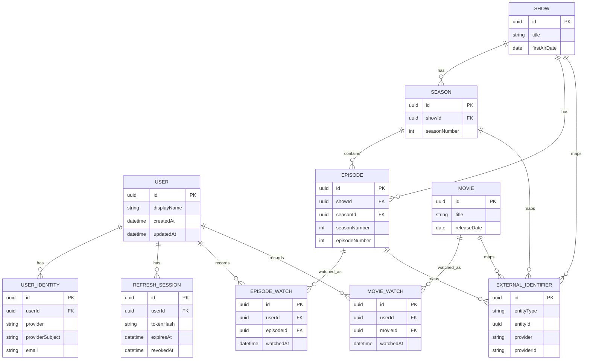

# Domain Model

TVLore separates external catalog metadata from TVLore-owned product data.

## Data Ownership

### External Catalog/Provider Data

TMDB initially provides:

- TV shows.
- Movies.
- Titles.
- Descriptions.
- Posters.
- Backdrops.
- Genres.
- Season metadata.
- Episode metadata.
- Release/air dates.
- Cast information where needed.
- Provider metadata where useful.

### TVLore-Owned Data

TVLore owns:

- Users.
- Identities.
- Viewing history.
- Watched timestamps.
- Rewatches.
- Show progress.
- Movie history.
- Ratings.
- Favorites.
- Watchlists.
- Future friendship relationships.
- Future match sessions.
- Future taste-profile data.
- Privacy settings.

Provider metadata should not determine application identity.

## Internal Identifiers

Tvlore entities should use internal UUIDs.

TMDB IDs must not be exposed as TVLore's permanent domain identity. Provider IDs are mappings, not primary identity.

Conceptual shape:

```text
Show
|-- id
|-- title
`-- externalIds
    |-- tmdb
    |-- imdb?
    `-- tvdb?

Movie
|-- id
|-- title
`-- externalIds
    |-- tmdb
    `-- imdb?
```

## Provider ID Storage Options

### Option A - Direct Provider Columns

Example:

```text
shows.tmdb_id
movies.tmdb_id
```

Pros:

- Simple queries.
- Easy uniqueness constraints.
- Fewer joins.

Cons:

- Couples schema to one provider.
- Adding IMDb/TVDB/Trakt mappings creates schema churn.
- Awkward when different entity types have different provider identifiers.

### Option B - ExternalIdentifier Table

Example:

```text
external_identifiers
|-- id
|-- entityType
|-- entityId
|-- provider
`-- providerId
```

Pros:

- Supports multiple providers.
- Keeps TVLore identity separate.
- Clean uniqueness per provider and entity type.
- Matches long-term catalog-provider boundary.

Cons:

- Adds joins.
- Requires careful constraints.
- Slightly more initial code.

### Recommendation

Use `ExternalIdentifier` for media catalog entities from the start. It is small enough for MVP and prevents TMDB IDs from becoming product identity.

## MVP Entities

### User

Represents a TVLore account.

Fields:

- `id`
- `displayName`
- `createdAt`
- `updatedAt`

### UserIdentity

Links a TVLore user to an external identity provider.

Fields:

- `id`
- `userId`
- `provider`
- `providerSubject`
- `email`
- `createdAt`
- `updatedAt`

Unique constraint:

- `(provider, providerSubject)`

### RefreshSession

Represents a mobile refresh session.

Fields:

- `id`
- `userId`
- `tokenHash`
- `createdAt`
- `expiresAt`
- `revokedAt`
- `rotatedAt`
- `lastUsedAt`
- `deviceLabel`

### Show

Internal TVLore show record. Created when a user interacts with or resolves a provider show.

Fields:

- `id`
- `title`
- `originalTitle`
- `overview`
- `posterPath`
- `backdropPath`
- `firstAirDate`
- `createdAt`
- `updatedAt`

### Season

Internal season record belonging to a show.

Fields:

- `id`
- `showId`
- `seasonNumber`
- `title`
- `overview`
- `posterPath`
- `airDate`
- `episodeCount`
- `createdAt`
- `updatedAt`

Unique constraint:

- `(showId, seasonNumber)`

### Episode

Internal episode record belonging to a season.

Fields:

- `id`
- `showId`
- `seasonId`
- `seasonNumber`
- `episodeNumber`
- `title`
- `overview`
- `stillPath`
- `airDate`
- `runtimeMinutes`
- `createdAt`
- `updatedAt`

Unique constraint:

- `(showId, seasonNumber, episodeNumber)`

### Movie

Internal movie record. Created when a user interacts with or resolves a provider movie.

Fields:

- `id`
- `title`
- `originalTitle`
- `overview`
- `posterPath`
- `backdropPath`
- `releaseDate`
- `runtimeMinutes`
- `createdAt`
- `updatedAt`

### EpisodeWatch

Represents one user watch of one episode.

Fields:

- `id`
- `userId`
- `episodeId`
- `watchedAt`
- `createdAt`

### MovieWatch

Represents one user watch of one movie.

Fields:

- `id`
- `userId`
- `movieId`
- `watchedAt`
- `createdAt`

### ExternalIdentifier

Maps internal entities to provider identifiers.

Fields:

- `id`
- `entityType`
- `entityId`
- `provider`
- `providerId`
- `createdAt`

Unique constraint:

- `(entityType, provider, providerId)`

## Future Concepts

Do not create these tables in the MVP unless promoted into scope:

- Rating.
- Favorite.
- Watchlist.
- Friendship.
- MatchShareToken.
- MatchSession.
- ProfilePrivacySettings.

## MVP ER Diagram



