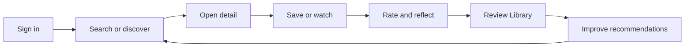

# TVLore Feature Catalog

This document lists TVLore's implemented and planned product capabilities. It
is product-facing first, then points to the backend/mobile pieces that support
each feature.

Status legend:

- `Ready`: implemented and usable in the current app/API.
- `Partial`: implemented but blocked by external setup, review, or release QA.
- `Deferred`: intentionally outside v1.0.

## v1 Product Loop

The implemented v1 loop is private and user-owned:

This loop defines what counts as release-critical:

| Step | Release-critical behavior |
| --- | --- |
| Sign in | Google auth returns to the app and restores the session after restart. |
| Search or discover | Search, picks, recommendations, available-to-stream, and popular rows open details. |
| Open detail | Show, movie, season, and episode screens load from backend-owned IDs. |
| Save or watch | Watchlist, movie watched, episode watched, season watched, and full-show watched mutate backend state. |
| Rate and reflect | Star rating, emotion, favorite character, and optional comment save without blocking watched state. |
| Review Library | Library refreshes counts and rows without manual refresh after returning. |
| Improve recommendations | Recommendation inputs come from explicit ratings and hydrated catalog data. |

Everything outside this loop is either hardening, store compliance, or post-1.0
product expansion.

## Ready Criteria

A feature is `Ready` only when these are true:

- The backend endpoint or provider boundary exists.
- The mobile surface calls the backend through a hook/API-client boundary.
- The flow works with a Supabase-authenticated user.
- The user-visible state can recover from loading or errors.
- The feature appears in release smoke or backlog documentation when it affects
  the v1 path.

Features can still be visually polished after they are `Ready`; polish alone
does not change the product status.

## 1. Account And Profile

| Feature | Status | User behavior | Backend/API | Mobile surface |
| --- | --- | --- | --- | --- |
| Google sign-in | Ready | User signs in with Google through Supabase. | Supabase token validation, `GET /users/me`. | Login/Profile bootstrap. |
| Apple sign-in | Partial | iOS user can use native Apple sheet after provider setup. | Supabase `signInWithIdToken` session accepted by normal auth flow. | iOS auth UI wired; release setup pending. |
| User profile | Ready | User sees identity, avatar, stats, and availability country. | `GET /users/me`, `PATCH /users/me`. | Profile. |
| Availability country | Ready | User chooses country used for Where to Watch/discovery. | Stored on TVLore user. | Profile country chips with flags. |
| Logout | Ready | User signs out and local cached/session state is cleared. | No backend mutation. | Profile. |
| Account deletion | Ready | User can request account deletion from Profile. | `GET /users/me/account-deletion`, `DELETE /users/me`. | Profile delete-account action. |
| Public legal pages | Ready | Store/user can open Privacy, Terms, Support, deletion page. | `/privacy`, `/terms`, `/support`, `/account-deletion`. | Profile links and store metadata. |

Known gaps:

- Apple Developer and Supabase Apple provider setup are still required for iOS
  release-like testing.
- Account deletion should still be QA-tested with a disposable account before
  public release.

## 2. Catalog Search And Resolve

| Feature | Status | User behavior | Backend/API | Mobile surface |
| --- | --- | --- | --- | --- |
| Search shows/movies | Ready | User searches text and filters all/shows/movies. | `GET /search`. | Search. |
| Debounced prefetch | Ready | Search starts fetching as the user types. | Same search endpoint. | Search hook/lookahead. |
| Resolve title | Ready | Opening a result creates/updates TVLore identity if needed. | `POST /catalog/resolve`. | Search/detail navigation. |
| Existing TVLore marker | Ready | Search can show whether a title is already known in TVLore. | Search hydrates `tvloreId`. | Search results. |

Known gaps:

- No offline search.
- No provider beyond TMDB.

## 3. Detail Screens

| Feature | Status | User behavior | Backend/API | Mobile surface |
| --- | --- | --- | --- | --- |
| Movie detail | Ready | User opens movie title, poster, overview, runtime, rating state. | `GET /movies/:movieId`. | Movie detail route. |
| Show detail | Ready | User opens show title, seasons, progress, rating state. | `GET /shows/:showId`. | Show detail route. |
| Season detail | Ready | User opens a season and sees paged/progressive episodes. | `GET /shows/:showId/seasons/:seasonNumber`. | Season route. |
| Episode detail | Ready | User opens an episode like a first-class detail item. | `GET /episodes/:episodeId`. | Episode route. |
| Cast detail for check-in | Ready | User picks favorite character from visual cast choices. | `GET /shows/:id/cast`, `GET /movies/:id/cast`, `GET /episodes/:id/cast`. | Check-in screen. |
| Public vs user rating | Ready | TMDB rating can be hidden as `Spoiler`; user rating shows separately. | Detail DTO includes `publicRating` and user `rating`. | Detail rating row. |

Known gaps:

- Detail UX can still be polished, but the functional routes exist.
- Direct streaming deep links depend on provider data quality/terms.

## 4. Tracking

| Feature | Status | User behavior | Backend/API | Mobile surface |
| --- | --- | --- | --- | --- |
| Movie watched/unwatched | Ready | User marks movie watched or unwatched. | `POST/DELETE /movies/:movieId/watches`. | Movie detail. |
| Episode watched/unwatched | Ready | User marks episode watched or unwatched. | `POST/DELETE /episodes/:episodeId/watches`. | Season and episode detail. |
| Season all watched/unwatched | Ready | User marks a full season in one action. | `POST/DELETE /shows/:showId/seasons/:seasonNumber/watches`. | Season detail. |
| Full show watched/unwatched | Ready | User marks all regular seasons in one action. | `POST/DELETE /shows/:showId/watches`. | Show detail. |
| Show progress | Ready | User sees not started, watching, or completed progress. | `GET /shows/:showId/progress`. | Show/season/library. |
| Optimistic mutations | Ready | UI updates immediately, then reconciles with backend response. | Existing tracking endpoints. | Detail/library actions. |

Known gaps:

- Specials / Season 0 are explicit season-level tracking, not part of full-show
  bulk actions.
- Rewatch history exists as a future modeling concern; MVP keeps one active
  watched marker per user/title.

## 5. Watchlist, Ratings, And Reflections

| Feature | Status | User behavior | Backend/API | Mobile surface |
| --- | --- | --- | --- | --- |
| Show/movie watchlist | Ready | User saves titles for later and removes them. | `POST/DELETE /shows/:id/watchlist`, `POST/DELETE /movies/:id/watchlist`. | Detail and Library. |
| Star ratings | Ready | User rates shows, movies, and episodes from 1 to 5 stars. | `PUT/DELETE /shows|movies|episodes/:id/preference`. | Detail/check-in. |
| Post-watch check-in | Ready | After watched, user can rate, pick emotion, favorite character, comment. | `PUT /shows|movies|episodes/:id/reflection`. | Check-in route. |
| Private reflection storage | Ready | Reflection is private product data for now. | Reflection tables per media type. | Check-in/detail state. |
| Swipe removal | Ready | User can remove saved/recent items with confirmable swipe actions. | Existing watchlist/tracking endpoints. | Library rows. |

Known gaps:

- Favorite-character community percentages are deferred until aggregate vote and
  privacy rules exist.
- No public comments or social visibility in v1.0.

## 6. Library

| Feature | Status | User behavior | Backend/API | Mobile surface |
| --- | --- | --- | --- | --- |
| Summary cards | Ready | User filters by Cronologia, Shows, Movies, Episodes, Watchlist, Rated. | `GET /library`. | Library. |
| Continue watching | Ready | User sees shows with partial progress. | `GET /library`. | Library. |
| Recent movies | Ready | User sees recently watched movies. | `GET /library`. | Library. |
| Grouped episodes | Ready | Watched episodes are grouped by show and season. | `GET /library`. | Library collapsible groups. |
| Cronologia | Ready | User scrolls paginated watch history by date. | `GET /library/chronology`. | Library Cronologia filter. |
| Rated list | Ready | User sees rated show/movie titles. | `GET /library`. | Library Rated filter. |
| Poster thumbnails | Ready | Rows show posters/stills when available, placeholders otherwise. | Existing catalog fields. | Library rows. |

Known gaps:

- Episode ratings are available on episode detail, but not yet a dedicated
  Library filter.
- Library visual polish continues through shared UI primitives.

## 7. Discovery And Recommendations

| Feature | Status | User behavior | Backend/API | Mobile surface |
| --- | --- | --- | --- | --- |
| TVLore Picks | Ready | User opens editorial picks curated by TVLore. | `GET /discovery/picks`. | Search entry and picks route. |
| Recommended picks | Ready | User opens personalized recommendations. | `GET /recommendations`. | Search entry and recommendations route. |
| Available to stream | Ready | User opens country-aware streamable titles. | `GET /discovery/available`. | Search entry and available route. |
| Popular in your country | Ready | User opens country-aware popular titles. | `GET /discovery/popular`. | Search entry and popular route. |
| Explainable score | Ready | Recommendation rows show reasons and TVLore score. | Recommendation service/repository. | Recommendation rows. |

Current recommendation inputs:

- User ratings.
- Persisted catalog genres.
- Media affinity.
- Country-aware streaming availability.
- Exclusion of already watched/saved/rated titles.

Known gaps:

- No collaborative filtering or ML.
- Stronger behavior signals are deferred until v1.0 blockers are cleared.

## 8. Where To Watch

| Feature | Status | User behavior | Backend/API | Mobile surface |
| --- | --- | --- | --- | --- |
| Country-aware providers | Ready | User sees stream/rent/buy/free provider icons by country. | `GET /shows/:id/watch-providers`, `GET /movies/:id/watch-providers`. | Show/movie detail. |
| Provider attribution | Ready | App shows availability source attribution. | Backend normalizes TMDB Watch Providers. | Detail panel. |
| Provider icon tap | Ready | Provider icons can open an allowed availability link when available. | Detail response/link normalization. | Detail panel. |

Known gaps:

- TMDB does not provide rich direct deep links for every provider/title.
- Richer provider contracts can be evaluated after v1.0.

## 9. Watch Paths

| Feature | Status | User behavior | Backend/API | Mobile surface |
| --- | --- | --- | --- | --- |
| Curated paths | Ready | User opens paths like Marvel or Star Wars. | `GET /watch-paths`, `GET /watch-paths/:pathId`. | Paths. |
| User-created paths | Ready | User creates personal ordered lists from TMDB refs/URLs. | `POST /watch-paths`. | Paths create flow. |
| TMDB Collection import | Ready | User imports a public TMDB Collection URL. | `POST /watch-paths/imports/tmdb-collection`. | Paths create flow. |
| Save full path | Ready | User saves every path title to watchlist in one action. | `POST /watch-paths/:pathId/watchlist`. | Path detail. |
| Lazy item resolve | Ready | Path item becomes TVLore identity only when opened/saved. | Catalog resolve/upsert. | Path item navigation. |

Known gaps:

- Additional public import sources are deferred until TMDB Collection import
  proves useful.

## 10. Release And Store Readiness

| Feature | Status | Notes |
| --- | --- | --- |
| Android package | Ready | `com.luiskabal.tvlore`. |
| Android production AAB | Ready | EAS generated version `5 (1.0.0)`. |
| Google Play internal testing | Ready | Release is active and tester install from Play has been confirmed. |
| Store metadata draft | Ready | `docs/store-metadata.md`. |
| Data inventory | Ready | `docs/data-inventory.md`. |
| Release smoke | Ready | `corepack pnpm release:android:smoke`. |
| Public legal URLs | Ready | Privacy, terms, support, account deletion. |
| Deobfuscation mapping | Deferred hardening | Non-blocking for internal testing; add before public hardening if minification is enabled. |
| Closed testing | Pending | Likely required for new personal Play Console accounts before production access. |
| iOS store path | Blocked | Apple Developer membership/provider setup still pending. |

## 11. Deferred Product Features

Deferred from v1.0:

- Public social feed.
- Friends/followers.
- TVLore Match and QR sharing.
- Public comments.
- Public favorite-character voting percentages.
- Payments/subscriptions.
- Push notifications.
- Offline mutation queue.
- Admin/web frontend.
- Advanced ML or collaborative recommendation engine.
- Rich direct streaming deep links unless provider terms/data support them.

These are intentionally deferred because they add privacy, moderation, policy,
support, or architecture surface area beyond the private-tracker v1.0.
