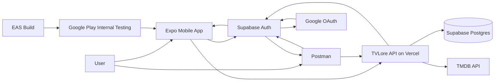

# TVLore Project Handbook

This handbook is the short, current map of TVLore. Use it before diving into
the deeper architecture, release, and product documents.

## 1. Product Summary

TVLore is a mobile-first private entertainment tracker for shows, seasons,
episodes, and movies.

The v1.0 product target is:

```text
Search -> save -> watch -> rate -> reflect -> rediscover from your own taste
```

The product is intentionally private for v1.0. Social matching, followers,
public comments, payments, and advanced recommendation engines are deferred.

## 2. Current Stack

| Layer | Current choice | Why |
| --- | --- | --- |
| Mobile | React Native, Expo SDK 54, Expo Router, TypeScript | Mobile-first app with fast iteration and store-build path. |
| Backend | NestJS modular monolith, TypeScript | Clear controller/service/repository boundaries without microservice overhead. |
| Database | Supabase Postgres, Prisma | Relational model for users, catalog identity, watches, ratings, reflections, paths. |
| Auth | Supabase Auth, Google OAuth | Supabase owns sessions; TVLore owns product identity. |
| Media provider | TMDB | Catalog, images, cast, ratings, discovery, watch-provider data. |
| Hosting | Vercel Functions | Production API at `https://tvlore-api.vercel.app`. |
| Mobile builds | EAS Build | Android preview APKs and production AABs. |
| Android distribution | Google Play Console | Internal testing is active for `com.luiskabal.tvlore`. |
| Contracts | Shared TypeScript/Zod package | Shared transport schemas and DTOs only. |
| Tests | Vitest, TypeScript checks, API smoke scripts | Fast unit/contract checks plus local/Vercel smoke checks. |

Excluded from the MVP: microservices, queues, Redis, Kafka, GraphQL, CQRS,
event sourcing, Kubernetes, and speculative state-management layers.

## 3. Repository Shape

```text
apps/
  api/       NestJS API, Prisma schema, Vercel runtime
  mobile/    Expo mobile app and EAS config
packages/
  contracts/ shared transport DTOs and schemas
docs/        architecture, release, backlog, and product docs
tools/       smoke checks, env checks, release helpers, Postman
```

Core rule:

```text
Mobile screen -> hook -> API/auth client
API controller -> service -> repository/provider
```

## 4. System Diagram



The mobile client never receives database credentials or the TMDB token. It
authenticates with Supabase, then calls TVLore with a Supabase bearer token.

## 5. Architecture Rules

- Backend is the source of truth.
- Mobile owns presentation, navigation, local interaction state, and loading
  feedback.
- Backend owns authorization, product identity, progress, tracking semantics,
  persistence, provider orchestration, and privacy boundaries.
- TMDB IDs are external references. TVLore UUIDs are product identity.
- Shared contracts validate transport shape, not business policy.
- TanStack Query owns server-state behavior in mobile.
- AsyncStorage is only for non-sensitive preferences.
- SecureStore is for sensitive mobile auth material.
- New product features should reuse the existing route/hook/API-client shape.

Boundary test:

```text
If a future web, TV, or native client would need the same rule,
that rule belongs in the backend.
```

## 6. Backend Services

The API is a modular monolith. Current modules:

| Module | Responsibility |
| --- | --- |
| `auth` | Validate Supabase access tokens and perform Supabase Admin account deletion when configured. |
| `users` | Resolve authenticated Supabase users into TVLore users and profile settings. |
| `catalog` | Search TMDB, resolve provider refs, persist shows/movies/seasons/episodes, expose details, cast, ratings, and watch providers. |
| `tracking` | Mark movies, episodes, seasons, and full shows watched/unwatched. |
| `watchlist` | Save/remove shows and movies for later. |
| `preferences` | Store 1-5 ratings for shows, movies, and episodes. |
| `reflections` | Store private post-watch reaction, favorite character, and optional comment. |
| `library` | Build user-owned Library, progress, and paginated Cronologia feeds. |
| `recommendations` | Generate explainable TVLore-scored suggestions from ratings, genres, media affinity, and availability. |
| `discovery` | Expose TVLore Picks, Popular in your country, and Available to stream. |
| `watch-paths` | Expose curated paths, user-created paths, TMDB imports, and save-to-watchlist flows. |
| `health` | Public API/database health plus Vercel release metadata. |
| `legal` | Public privacy, terms, support, and account-deletion pages for stores. |
| `config` | Centralized validated environment configuration. |

## 7. Mobile Surfaces

| Surface | Main jobs |
| --- | --- |
| Library | Personal summary, Cronologia, shows in progress, watched movies, grouped episodes, watchlist, rated titles. |
| Search | Catalog search, TVLore Picks, recommendations, Available to stream, Popular in your country. |
| Paths | Curated and personal viewing orders, TMDB title/collection imports, save full path to watchlist. |
| Profile | User identity, holo stats card, country preference, legal links, logout, account deletion. |
| Detail screens | Show/movie/season/episode details, tracking, watchlist, ratings, where-to-watch, cast. |
| Check-in | Post-watch star rating, emotion, favorite character picker, optional comment. |

Mobile UX/performance patterns already in place:

- Screen/hook/API-client separation.
- Reusable UI atoms and molecules for text, buttons, badges, panels, posters,
  skeletons, stat cards, media rows, segmented controls, and tab navigation.
- Skeletons and previous-data retention for slow API responses.
- Optimistic UI for watched, watchlist, ratings, and swipe removals.
- Lookahead prefetch for Search, recommendations, Library, and Watch Paths.
- Progressive loading for long season and chronology lists.

## 8. Product Features Implemented

### Account And Identity

- Google login through Supabase Auth.
- Native iOS Apple Sign-In UI/token exchange is implemented but iOS provider
  release setup is blocked by Apple Developer membership.
- Authenticated user profile with availability country.
- In-app account deletion backed by API-owned data deletion and Supabase Admin
  deletion when `SUPABASE_SERVICE_ROLE_KEY` is configured.
- Public privacy, terms, support, and account deletion URLs.

### Catalog And Details

- TMDB-backed show/movie search.
- Resolve TMDB refs into internal TVLore IDs.
- Show, movie, season, and episode detail screens.
- Cast endpoints for favorite-character selection.
- TMDB public ratings on details.
- Country-aware Where to Watch from TMDB Watch Providers.

### Tracking And Library

- Movie watched/unwatched.
- Episode watched/unwatched.
- Season mark all watched/unwatched.
- Full-show mark all watched/unwatched.
- Watchlist save/remove for shows and movies.
- Show/movie/episode 1-5 star ratings.
- Post-watch reflections with emotion, favorite character, and comment.
- Library counts, filters, grouped episodes, continue watching, rated titles,
  watchlist, and paginated Cronologia.

### Discovery And Paths

- TVLore Picks editorial discovery.
- Personalized recommendations with explainable TVLore score.
- Available to stream in the user's country.
- Popular in the user's country.
- Curated Watch Paths.
- User-owned Watch Paths from TMDB refs, pasted TMDB URLs, or TMDB Collection
  URLs.
- Save a full path into watchlist through one backend-owned action.

## 9. Runtime Services And Secrets

Backend production envs live in Vercel:

```text
DATABASE_URL
MIGRATE_DATABASE_URL
SUPABASE_URL
SUPABASE_PUBLISHABLE_KEY
SUPABASE_SERVICE_ROLE_KEY
TMDB_ACCESS_TOKEN
API_RATE_LIMIT_MAX_REQUESTS
API_RATE_LIMIT_WINDOW_SECONDS
PROVIDER_RATE_LIMIT_MAX_REQUESTS
PROVIDER_RATE_LIMIT_WINDOW_SECONDS
```

Mobile build envs live in EAS for `development`, `preview`, and `production`:

```text
EXPO_PUBLIC_TVLORE_API_BASE_URL
EXPO_PUBLIC_SUPABASE_URL
EXPO_PUBLIC_SUPABASE_PUBLISHABLE_KEY
```

Never commit real database passwords, service-role keys, OAuth tokens, TMDB
tokens, or reviewer credentials.

## 10. Verification Commands

Normal code verification:

```powershell
corepack pnpm verify
```

Release-oriented verification:

```powershell
corepack pnpm verify:full
corepack pnpm release:android:smoke
```

HTTP smoke:

```powershell
corepack pnpm api:check
```

Authenticated product smoke requires:

```powershell
$env:TVLORE_SUPABASE_ACCESS_TOKEN="..."
corepack pnpm api:check
```

## 11. Android Release Status

Current Android package:

```text
com.luiskabal.tvlore
```

Current Play Console state:

- Google Play developer identity is verified.
- TVLore app record exists.
- Internal testing track is active.
- Release `2 (1.0.0)` is rolled out to internal testers.
- The first uploaded artifact is an EAS production AAB.
- Google Play may show the app as `unreviewed` while the listing/release
  propagates.

Known non-blocking warning:

- Deobfuscation mapping file is not uploaded. This is documented as release
  hardening before public production if minification/obfuscation is enabled.

Next Android gates:

1. Install from the internal testing opt-in link once Play propagation finishes.
2. Run Android manual QA from `docs/release-smoke-checklist.md`.
3. Capture store screenshots from a release-like build.
4. Complete Play Console app content, data safety, content rating, app access,
   and store listing.
5. Promote to closed testing if Play Console requires the 12-tester/14-day
   personal-account gate before production access.

## 12. v1.0 Remaining Work

Release blockers:

- Android internal Play install and manual QA.
- Store screenshots.
- Play Console app content forms.
- Closed testing gate if required.
- iOS Apple Developer renewal and provider setup before iOS release work.

Hardening:

- Deobfuscation mapping if Android minification is enabled.
- Minimal crash/error monitoring if release testing surfaces opaque failures.
- Final review of TMDB/JustWatch attribution and privacy wording.

Product polish:

- Continue UI polish through reusable primitives.
- Improve recommendation quality only after release blockers are cleared.
- Add favorite-character voting percentages after privacy/community rules exist.

## 13. Where To Read Next

- Full current implementation: [Current State](current-state.md)
- Architecture rules: [Architecture](architecture.md)
- Backend details: [Backend Architecture](backend-architecture.md)
- Mobile details: [Mobile Architecture](mobile-architecture.md)
- Stack choices: [Stack](stack.md)
- Runtime infrastructure: [Infrastructure Setup](infrastructure.md)
- v1.0 release plan: [Release v1.0 Roadmap](release-v1-roadmap.md)
- Android Play steps: [Google Play Android Release Prep](google-play-android-release.md)
- Store metadata: [Store Metadata Pack](store-metadata.md)
- Data safety inputs: [Data Inventory](data-inventory.md)
- Working queue: [Backlog](backlog.md)
