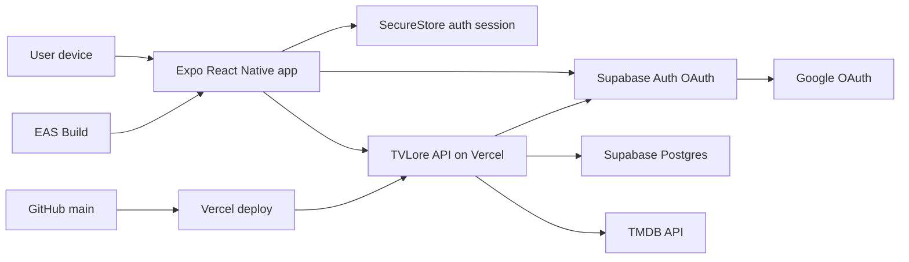
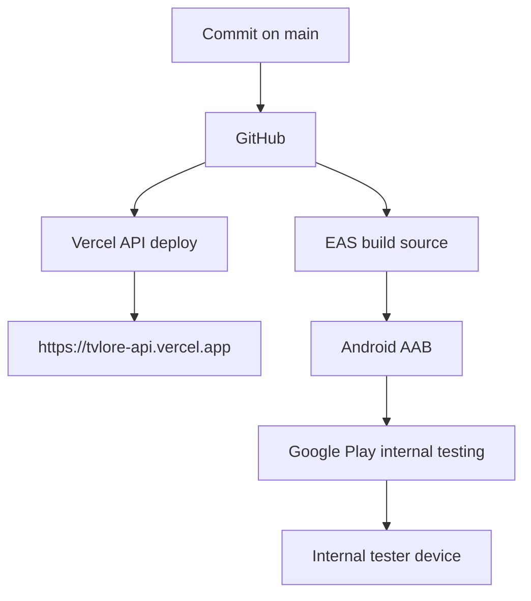

# TVLore Service Map

This document explains the moving parts of TVLore as runtime services. Use it
when you need to understand where a request goes, where secrets live, or which
system owns a behavior.

## 1. Runtime Services

| Service | Owner | Runs where | Main responsibility |
| --- | --- | --- | --- |
| Mobile app | TVLore | Expo development build, Android internal testing build, future stores | User interface, navigation, local interaction state, auth session storage. |
| Backend API | TVLore | Vercel Functions, project `tvlore-api` | Domain rules, auth verification, persistence, TMDB orchestration, legal pages. |
| Supabase Auth | Supabase | Supabase project `qpekdijebjzigrgcumpv` | Google OAuth, user sessions, access tokens, optional auth admin deletion. |
| Supabase Postgres | Supabase | Supabase project `qpekdijebjzigrgcumpv` | TVLore users, identities, catalog rows, watches, ratings, reflections, paths. |
| TMDB API | External provider | TMDB | Catalog search, title detail metadata, cast, watch providers, popularity. |
| Vercel | Deployment platform | `https://tvlore-api.vercel.app` | Backend deploy, runtime env vars, production API URL. |
| EAS Build | Expo | Expo cloud | Android/iOS build artifacts and app env injection. |
| Google Play Console | Google | Play Console | Android app record, internal testing, closed testing, production review. |
| GitHub | Source control | `https://github.com/luiskabal/tvlore` | Versioned source, docs, release rollback trail. |

## 2. Service Dependency Matrix

| TVLore capability | Internal owner | External services | Sensitive server envs |
| --- | --- | --- | --- |
| Login/session | Mobile `src/auth`, API `auth`/`users` | Supabase Auth, Google OAuth | None in mobile; backend uses `SUPABASE_URL`, `SUPABASE_PUBLISHABLE_KEY`. |
| User profile/country | API `users` | Supabase Auth, Supabase Postgres | `DATABASE_URL`. |
| Account deletion | API `users`/`auth` | Supabase Auth Admin, Supabase Postgres | `DATABASE_URL`, `SUPABASE_SERVICE_ROLE_KEY`. |
| Catalog search/resolve | API `catalog` | TMDB, Supabase Postgres | `DATABASE_URL`, `TMDB_ACCESS_TOKEN`. |
| Details/cast/providers | API `catalog` | TMDB, Supabase Postgres | `DATABASE_URL`, `TMDB_ACCESS_TOKEN`. |
| Tracking/progress | API `tracking`, `library` | Supabase Postgres, TMDB for bulk hydration | `DATABASE_URL`, `TMDB_ACCESS_TOKEN` when hydration is needed. |
| Watchlist | API `watchlist` | Supabase Postgres | `DATABASE_URL`. |
| Ratings/reflections | API `preferences`, `reflections` | Supabase Postgres | `DATABASE_URL`. |
| Recommendations/discovery | API `recommendations`, `discovery` | Supabase Postgres, TMDB | `DATABASE_URL`, `TMDB_ACCESS_TOKEN`. |
| Watch Paths | API `watch-paths`, `catalog` | Supabase Postgres, TMDB | `DATABASE_URL`, `TMDB_ACCESS_TOKEN`. |
| Legal/store pages | API `legal` | Vercel | None beyond API runtime. |
| Android release | EAS/Play Console | Expo EAS, Google Play | EAS public mobile envs, no backend secrets in mobile. |

Rule of thumb:

```text
If the mobile app needs provider data, ask TVLore API.
If TVLore API needs product data, ask Postgres.
If TVLore API needs identity proof, ask Supabase Auth.
If TVLore API needs catalog/provider metadata, ask TMDB.
```

## 3. High-Level Flow



Core rule: the mobile app talks to the backend for product data. It only talks
to Supabase directly for authentication/session work.

## 4. Request Ownership

### App Bootstrap

1. Mobile loads public env values from the build.
2. Mobile restores the Supabase session from device storage.
3. Mobile calls `GET /users/me` with the Supabase access token.
4. Backend validates the token with Supabase and returns the TVLore user.
5. Mobile hydrates Library/Profile through route hooks and the TVLore API
   client.

Why this shape: Supabase proves identity; TVLore still owns product identity,
profile settings, library state, and authorization decisions.

### Google Sign-In

1. Mobile opens Supabase Google OAuth.
2. Google authenticates the user.
3. Supabase returns an app session through the configured redirect.
4. Mobile stores the session securely.
5. Backend later validates the access token on protected routes.

Important boundary: Google login does not create product state by itself. The
TVLore user is created/upserted when the backend receives a valid token.

### Catalog Search

1. Mobile debounces the search input and asks `GET /search`.
2. Backend validates auth and calls TMDB with the server-side token.
3. Backend normalizes TMDB results and marks known TVLore items when possible.
4. Mobile renders results and progressively fetches more pages when needed.

Why this shape: TMDB credentials stay server-side, and provider IDs never become
the main product identity in the app.

### Opening A Title

1. Mobile sends `POST /catalog/resolve` with a provider reference.
2. Backend fetches TMDB detail and upserts TVLore catalog rows.
3. Backend returns an internal TVLore show/movie ID.
4. Mobile navigates to `/shows/:id` or `/movies/:id`.

Why this shape: search can stay lightweight, and TVLore only persists catalog
entities when the user expresses intent.

### Tracking And Rating

1. Mobile sends watched/watchlist/rating/reflection mutation.
2. Mobile applies optimistic UI where the action is reversible.
3. Backend validates the user and writes user-owned rows in Postgres.
4. Mobile invalidates local library/detail cache and reconciles the server
   response.

Why this shape: product state remains backend-owned while the UI feels fast.

### Where To Watch And Discovery

1. Mobile asks backend for provider or discovery routes.
2. Backend uses the user's availability country.
3. Backend calls TMDB provider/discover endpoints.
4. Mobile renders provider icons, country labels, and recommendation rows.

Why this shape: availability changes by country and provider, so the backend
keeps that logic centralized.

## 5. Configuration Ownership

| Variable | Runtime | Secret? | Owner |
| --- | --- | --- | --- |
| `DATABASE_URL` | Backend/Vercel/local API | Yes | Vercel/local `.env` only. |
| `MIGRATE_DATABASE_URL` | Backend migration tooling | Yes | Vercel/local `.env` only. |
| `SUPABASE_URL` | Backend | No | Vercel/local `.env`. |
| `SUPABASE_PUBLISHABLE_KEY` | Backend | Public-ish | Vercel/local `.env`. |
| `SUPABASE_SERVICE_ROLE_KEY` | Backend | Yes | Vercel only for deployed deletion; local `.env` if testing admin deletion. |
| `TMDB_ACCESS_TOKEN` | Backend | Yes | Vercel/local `.env` only. |
| `API_RATE_LIMIT_*` | Backend | No | Optional backend tuning. |
| `PROVIDER_RATE_LIMIT_*` | Backend | No | Optional TMDB-cost route tuning. |
| `EXPO_PUBLIC_TVLORE_API_BASE_URL` | Mobile | No | EAS env/local mobile `.env`. |
| `EXPO_PUBLIC_SUPABASE_URL` | Mobile | No | EAS env/local mobile `.env`. |
| `EXPO_PUBLIC_SUPABASE_PUBLISHABLE_KEY` | Mobile | Public-ish | EAS env/local mobile `.env`. |

Mobile `EXPO_PUBLIC_*` values are bundled into the app. Never put database
credentials, TMDB tokens, service-role keys, or provider secrets behind an
`EXPO_PUBLIC_` prefix.

## 6. Deployment Chain



Operational notes:

- Vercel deploys the backend from `apps/api`.
- EAS builds the mobile app from `apps/mobile`.
- Google Play internal testing distributes the `.aab` after Play processing.
- The Android package name is `com.luiskabal.tvlore`.
- The iOS bundle identifier is also `com.luiskabal.tvlore`, but iOS release is
  blocked until Apple Developer/Supabase Apple provider setup is complete.

## 7. Failure Points

| Symptom | Likely owner | First check |
| --- | --- | --- |
| App cannot login after Google | Supabase Auth / redirect URL | Supabase redirect URLs and mobile scheme `tvlore://auth/callback`. |
| API returns `401` | Auth/token | Fresh Supabase access token, `Authorization: Bearer ...`. |
| API returns `500` on DB routes | Vercel/Supabase DB | `GET /health/db`, `DATABASE_URL`, Supabase pooler status. |
| Search is empty or slow | TMDB/provider | `TMDB_ACCESS_TOKEN`, provider rate limits, query debounce. |
| Where to Watch missing provider | TMDB/provider data | Country code and TMDB watch-provider availability. |
| Internal test app not found | Google Play | Tester email, opt-in state, Play propagation/review delay. |
| Account deletion not configured | Backend env | `SUPABASE_SERVICE_ROLE_KEY` in Vercel Production/Preview. |

## 8. Verification Commands

```powershell
corepack pnpm env:check
corepack pnpm eas:env:check
corepack pnpm release:android:preflight
corepack pnpm store:check
corepack pnpm auth:redirect:check
corepack pnpm verify
corepack pnpm verify:full
corepack pnpm api:check
corepack pnpm release:android:smoke
```

Use `verify` for normal code changes. Use `verify:full` and Android release
checks when build output, EAS config, store readiness, or release packaging
changes.

## 9. Current Release State

- Backend production API is deployed on Vercel.
- Supabase Auth, Supabase Postgres, and TMDB are wired.
- Android internal testing release `7 (1.0.0)` has been created in Google Play.
- Tester install from the Google Play internal testing flow has been confirmed.
- Closed testing is still expected before production access for a new personal
  Play Console account.
- iOS release remains blocked by Apple Developer membership/provider setup.
