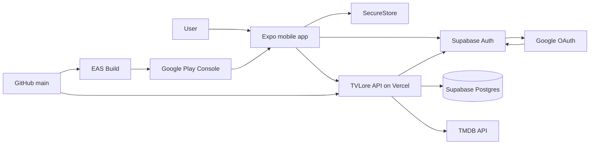
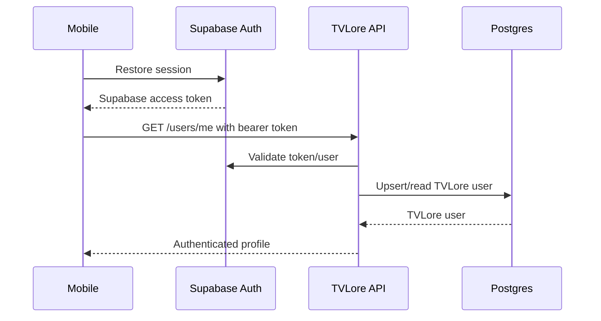
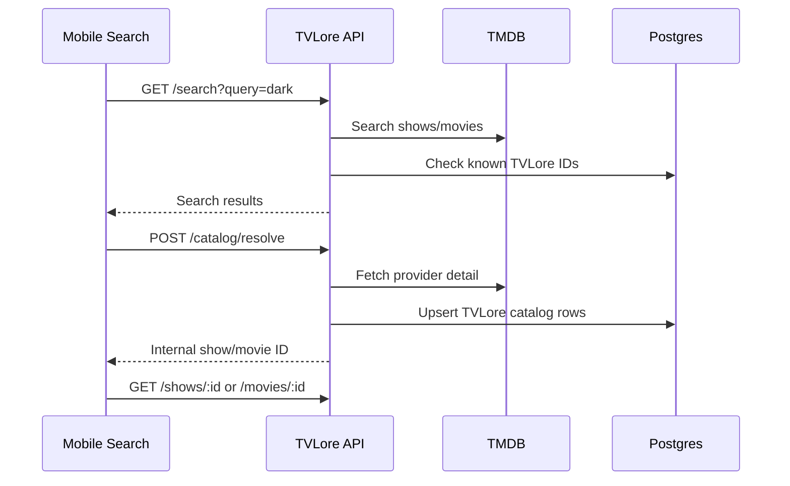
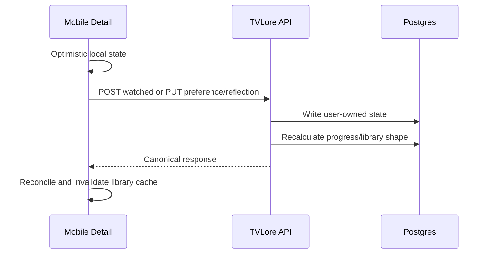
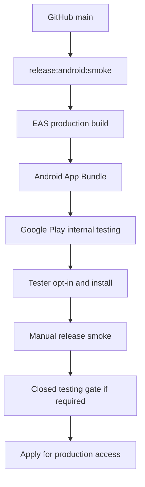

# System Context Map

This is the fast orientation map for TVLore. Use it when you want the full
system in one pass before diving into deeper docs.

## Current Stack Snapshot

| Area | Current choice | Version/source |
| --- | --- | --- |
| Monorepo | pnpm workspaces | `pnpm@10.14.0` |
| Mobile | Expo, React Native, Expo Router, TypeScript | Expo `54`, React Native `0.81`, React `19`, Expo Router `6` |
| Backend | NestJS modular monolith, TypeScript | NestJS `11` |
| Database | Supabase Postgres | Prisma `7` client and migrations |
| Auth | Supabase Auth | Google OAuth, native app callback |
| Catalog provider | TMDB | Backend-only API token |
| API hosting | Vercel Functions | `https://tvlore-api.vercel.app` |
| Mobile builds | EAS Build | Android preview APKs and production AABs |
| Android distribution | Google Play Console | Internal testing track active |
| Tests | Vitest and TypeScript checks | API and mobile test suites |

## Runtime System



The mobile app talks directly to Supabase only for auth/session work. Product
data goes through the TVLore backend.

## Ownership Rules

| Concern | Owner | Why |
| --- | --- | --- |
| Login/session | Supabase Auth plus mobile auth client | Supabase issues the session; mobile stores it securely. |
| Product identity | Backend | TVLore UUIDs stay independent from provider IDs. |
| Authorization | Backend | Every protected product route validates the Supabase bearer token. |
| Catalog metadata | Backend provider adapter | TMDB token stays server-side and provider data is normalized. |
| Watches/progress | Backend | Progress must be consistent across future clients. |
| Ratings/reflections | Backend | These are private user-owned product signals. |
| Presentation | Mobile | React Native owns layout, navigation, loading, optimistic affordances. |
| Build artifacts | EAS/Google Play | EAS creates artifacts; Play distributes the Android release. |

Boundary test:

```text
If another client would need the same decision, put it in the backend.
If it only changes what the current user sees/taps, keep it in mobile.
```

## Main Request Flows

### Auth Bootstrap



### Search And Open Title



### Watched, Rating, And Reflection



### Android Release



## Feature To Service Matrix

| Feature area | Mobile | API | Supabase | TMDB | Play/EAS |
| --- | --- | --- | --- | --- | --- |
| Google login | Auth UI and callback | Token validation | OAuth/session owner | None | Release callback must work in builds |
| Search | Input, filters, results, prefetch | Auth, TMDB proxy, known IDs | Token validation | Search provider | None |
| Detail screens | Presentation, skeletons, actions | Details, cast, providers, progress | Token validation | Metadata/cast/providers | None |
| Tracking | Optimistic UI and reconciliation | Watches and progress writes | Token validation | Optional hydration | None |
| Ratings/reflections | Stars, emotion, cast picker, comment | Preferences/reflections persistence | Token validation | Cast metadata | None |
| Library | Filters, Cronologia, grouped rows | Library and chronology DTOs | Token validation | None directly | None |
| Recommendations | Rows and detail navigation | TVLore score and reasons | Token validation | Catalog/discovery data | None |
| Watch Paths | Path list/detail/import UI | Path persistence/import/save-all | Token validation | Collection/title hydration | None |
| Where to Watch | Provider icon rendering | Country/provider normalization | Token validation | Watch Providers | None |
| Account deletion | Profile action | User data and Supabase Admin deletion | Auth user deletion | None | Store policy requirement |
| Android release | Installed app behavior | Public legal/API URLs | OAuth works in build | Provider smoke | Artifact distribution |

## Repository Reading Map

```text
apps/mobile/src/ui/          shared presentation primitives
apps/mobile/src/<feature>/   mobile route components, hooks, models, styles
apps/mobile/src/api/         mobile TVLore API client facade and endpoint groups
apps/mobile/src/auth/        Supabase mobile auth/session behavior

apps/api/src/<module>/       NestJS controller/service/repository/provider modules
apps/api/prisma/             database schema and migrations
packages/contracts/src/      shared transport schemas and DTOs
tools/                       smoke checks, env checks, release helpers, Postman
docs/                        architecture, product, release, and operations docs
```

## Current Release Reality

TVLore is not public production yet.

Current state:

- Backend is deployed on Vercel.
- Supabase Auth/Postgres are wired.
- Android app exists in Google Play Console.
- Internal testing release `7 (1.0.0)` is active.
- Tester install from Google Play internal testing is confirmed.
- Closed testing and store content forms remain before public Android
  production.
- iOS production remains blocked by Apple Developer membership/provider setup.

## Deeper Docs

- Stack details: [Stack](stack.md)
- Runtime service map: [Service Map](service-map.md)
- Mobile architecture: [Mobile Architecture](mobile-architecture.md)
- Mobile UI system: [Mobile UI System](mobile-ui-system.md)
- Backend architecture: [Backend Architecture](backend-architecture.md)
- Data model: [Data Model Map](data-model-map.md)
- API endpoints: [API Endpoint Map](api-endpoint-map.md)
- Android release flow: [Google Play Android Release Prep](google-play-android-release.md)
- Operations: [Operations Runbook](operations-runbook.md)
