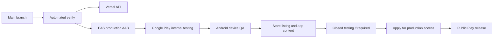

# v1.0 Release Gap Map

This document reconciles the implemented product with what still blocks a real
Android 1.0 release candidate.

The goal is to avoid two common release mistakes:

- calling the app "production-ready" just because the code works locally,
- adding more product features while store, device, and compliance gates are
  still open.

## 1. What Android 1.0 Means

For TVLore, Android 1.0 has three levels:

| Level | Meaning | Current state |
| --- | --- | --- |
| Internal testing build | A Play-distributed build that trusted testers can install. | Ready: release `5 (1.0.0)` is active and tester install from Play has been confirmed on device. |
| Release candidate | The internal/closed build passes manual QA, store forms are complete, and no blocker bugs remain. | Not yet. |
| Public production | Google Play approves production access and the app is visible publicly. | Not yet. |

So "Android 1.0" does not mean "every idea is built." It means the private
tracking loop is stable enough to submit, review, and support.

## 2. Gate Diagram



Current position:

```text
EAS production AAB uploaded -> Play internal testing active -> tester install
confirmed -> full Android device QA and Play app-content gates pending.
```

## 3. Ready Now

| Area | Ready signal |
| --- | --- |
| API | Vercel production API exists at `https://tvlore-api.vercel.app`. |
| Database | Supabase Postgres is connected through Prisma. |
| Auth | Google OAuth works through Supabase; backend validates Supabase bearer tokens. |
| Account deletion | API and Profile flow exist; production reports deletion readiness when service role is configured. |
| Catalog | Search, resolve, show, movie, season, episode, cast, ratings, and watch providers exist. |
| Tracking | Movie, episode, season, and full-show watched/unwatched flows exist. |
| Library | Summary, Cronologia, grouped episodes, watchlist, rated titles, and progressive chronology exist. |
| Reflections | Post-watch rating, emotion, favorite character, and optional comment exist. |
| Discovery | TVLore Picks, recommendations, available-to-stream, and popular-in-country exist. |
| Watch Paths | Curated paths, personal paths, TMDB URL import, TMDB Collection import, and save-to-watchlist exist. |
| Mobile UX base | Bottom tabs, reusable UI primitives, skeletons, optimistic updates, and prefetch/read cache exist. |
| Android build lane | EAS profiles exist and a production AAB has been accepted by Play internal testing. |
| Store/legal URLs | Privacy, Terms, Support, and account deletion pages are public. |

## 4. Active Release Gates

These are the items that decide whether the current build can become a real
Android 1.0 candidate.

| Gate | Why it matters | Next proof |
| --- | --- | --- |
| Play internal install | The app must install from Google Play, not only from a local APK. | Done: opt-in tester can tap Download test app and install TVLore from Play. |
| Android manual QA | Store-distributed builds can expose auth, deep-link, network, and packaging issues that local dev builds hide. | Run `docs/release-smoke-checklist.md` on the Play build. |
| Google auth callback | The release build must return from Supabase/Google OAuth into the app. | Log in from the installed Play build, cold restart, and keep the session. |
| Core loop QA | v1.0 is the private tracking loop. | Search -> detail -> watchlist -> watched -> check-in -> Library refresh works. |
| Store screenshots | Store screenshots must match the actual release-like UI. | Capture the screenshot set from `docs/store-metadata.md`. |
| Play app content | Google requires privacy, data safety, content rating, app access, and account deletion answers. | All Play Console app-content tasks complete without blocking warnings. |
| Closed testing gate | New personal Play accounts may need 12 opted-in testers for 14 continuous days before production access. | Closed test reaches the required tester count/time, if Play Console requires it. |
| Production access application | Google may require a production-access request after closed testing. | Production access is granted. |

## 5. Hardening Before Public Production

These are not necessarily blockers for internal testing, but they reduce first
user and review risk.

| Item | Why |
| --- | --- |
| Account deletion disposable QA | Deletion is destructive. Test it only with a disposable account before relying on it in review. |
| Authenticated API smoke with fresh token | Confirms Vercel, Supabase Auth, DB, TMDB, tracking, ratings, and library contracts still work together. |
| Deobfuscation mapping | If Android minification/obfuscation is enabled, Play crash reports need the matching mapping file to be readable. |
| Crash/error monitoring | Useful if closed/internal testers hit opaque mobile failures. Add the smallest useful tool only if needed. |
| TMDB/JustWatch attribution review | Where-to-watch surfaces must keep attribution and claims aligned with provider terms. |
| Store copy review | Store metadata must only promise features that are present in the actual build. |

## 6. Product Polish That Should Not Block 1.0

These are valuable, but should stay behind release gates unless one of them
causes a severe first-session failure.

- Fine tuning every skeleton to perfectly match final content.
- Deeper recommendation ranking or collaborative filtering.
- Favorite-character community percentages.
- Direct provider deep links beyond the supported availability URL.
- More Watch Path import sources.
- Full visual redesign beyond the reusable UI primitives already in place.
- Offline mutation queue.

## 7. Deferred After Android 1.0

| Feature | Why deferred |
| --- | --- |
| iOS release | Apple Developer membership/provider setup is a separate external gate. |
| Social matching | Adds privacy, moderation, reporting, and community safety requirements. |
| Public comments | User-generated content moderation belongs after the private loop is stable. |
| Payments/subscriptions | Adds store billing policy, tax, entitlement, and support obligations. |
| Admin/web frontend | Useful later, but not required for a private mobile tracker release. |
| Advanced ML recommendations | The explainable TVLore score is enough for v1.0 validation. |

## 8. Next Execution Order

Do these in order:

1. Run Android manual QA from `docs/release-smoke-checklist.md`.
2. Record only blocker or major bugs in `docs/backlog.md`.
3. Fix blocker bugs in small commits and rebuild only when needed.
4. Capture store screenshots from a release-like build.
5. Complete Play Console app content, Data safety, Content rating, App access,
   account deletion, and store listing.
6. Move to closed testing if Play Console requires the 12-tester/14-day gate.
7. Apply for production access after the closed-test gate is satisfied.

## 9. Decision Rule

When choosing between a new feature and a release gate:

```text
If it helps install, authenticate, track, delete, review, or explain the app,
do it before Android 1.0.

If it makes the product cooler but does not reduce release risk, defer it.
```
